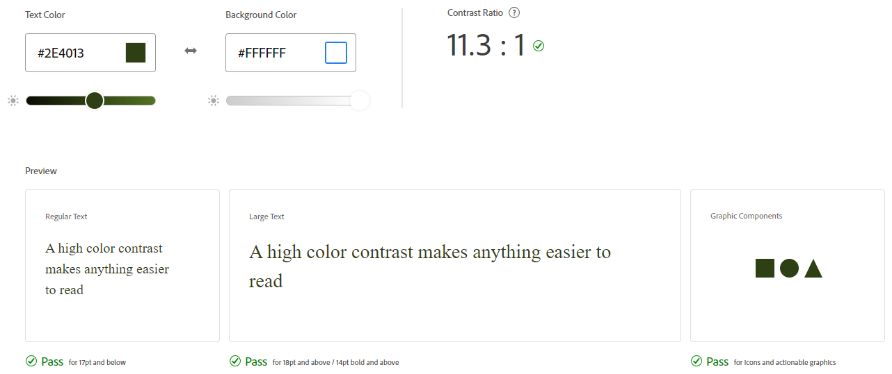
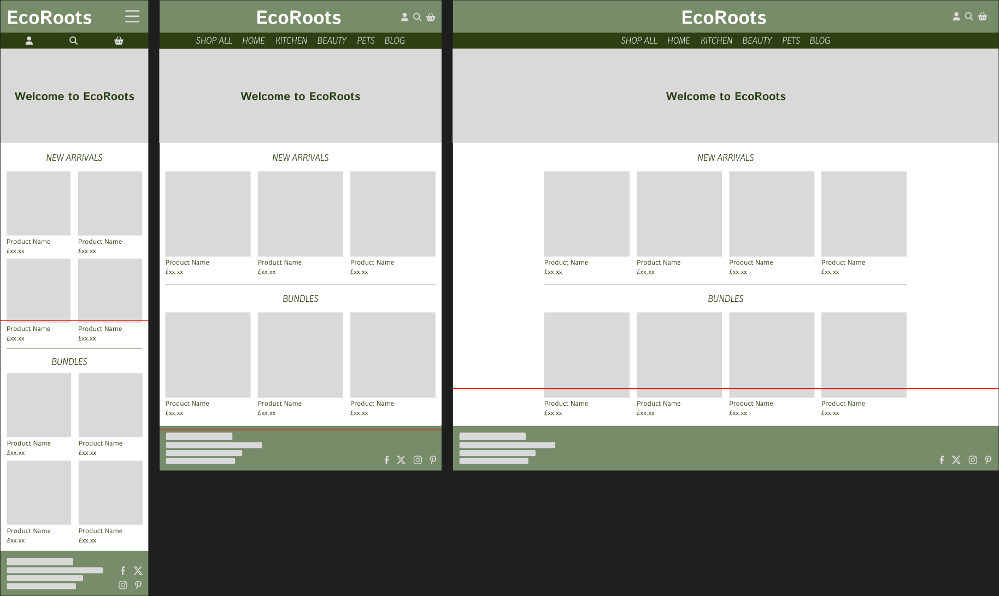

# EcoRoots - *Milestone Project Four*

**Find the final project here:**

## Table of Contents
1. [Project Overview](#project-overview)
2. [User Experience](#user-experience)
3. [Brand Design](#brand-design)
4. [Site Planning](#site-planning)
5. [Data Schema](#data-schema)
6. [Project Management](#project-management)
7. [Site Development](#site-development)
    * [Site Features](#universal-site-elements)
    * [Testing During Development](#testing-during-development)
8. [Credits & Acknowledgements](#credits--acknowledgements)

## Project Overview

EcoRoots is an e-commerce website dedicated to offering a curated selection of eco-friendly Beauty, Home, Kitchen & Pet products. This project aims to provide users with a seamless and enjoyable shopping experience while promoting environmentally conscious consumerism.

## User Experience

The key elements of good user experience on an e-commerce site are simplicity, intuitive navigation, and responsiveness. As a minimum, users should be able to easily browse through products and product categories, add items to their cart, and proceed through a secure checkout process. Features such as product reviews, wishlist creation and blog posts can further enhance the user experience.

### Site Goals
EcoRoots has various goals aligned with promoting sustainability, attracting environmentally conscious consumers, and running a successful online business. Here are the site's goals:

- **Promote Sustainable Living:** Encourage and facilitate a more sustainable lifestyle by providing eco-friendly alternatives for everyday beauty, home, kitchen & pet products.

- **Curate a Thoughtful Product Selection:** Create a carefully curated selection of eco-friendly products that meet high standards of sustainability, ethical sourcing, and environmental responsibility.

- **Attract Environmentally Conscious Consumers:** Build a customer base of environmentally conscious individuals who prioritise eco-friendly choices and actively seek products that align with their values.

- **Provide Transparent Information:** Offer transparent and detailed information about product materials, sourcing, and manufacturing processes to build trust with consumers and foster informed decision-making.

- **Encourage Responsible Consumption:** Advocate for responsible consumption by promoting product longevity, reuse, and recycling. Provide information on proper disposal and recycling options for products.

- **Enhance User Experience:** Provide a user-friendly and intuitive online shopping experience that makes it easy for customers to find, purchase, and receive eco-friendly products.

- **Reduce Environmental Impact:** Strive to minimise the environmental impact of the business operations, from sourcing products from local suppliers to reducing the environmental impact of packaging and shipping.

- **Continuous Innovation:** Stay at the forefront of eco-friendly trends and technologies, regularly updating the product range to incorporate the latest sustainable innovations.

- **Educate Consumers:** Offer educational content to inform consumers about the environmental impact of their choices and provide insights into sustainable living practices.

### Persona One

**User:** Emma Green, 32

Emma is a marketing professional living in Cardiff. She is passionate about environmental sustainability and actively engages in reducing her ecological footprint. She values transparency, authenticity, and seeks products that align with her eco-friendly lifestyle.

### Emma's Goals:

- **Sustainable Living:** Emma's primary goal is to live a sustainable lifestyle. She aims to minimise waste, choose eco-friendly alternatives, and support companies with environmentally responsible practices.

- **Conscious Consumerism:** Emma wants to make informed choices when purchasing products. She looks for ethical sourcing, fair labour practices, and renewable materials.

- **Discover New Products:** Emma is always on the lookout for innovative and eco-friendly products within the beauty, home & kitchen categories.

- **Convenience:** While being eco-conscious is a priority, Emma also values convenience. She seeks a user-friendly online shopping experience that allows her to quickly find, purchase, and receive eco-friendly products.

### How the Site Can Help Emma:

- **Curated Selection:** The website can provide Emma with a carefully curated selection of eco-friendly and sustainable products. This helps her discover new and innovative items that align with her values.

- **Detailed Product Information:** Emma values transparency. Providing detailed information about each product, including materials, manufacturing processes, and ethical practices, helps her make informed decisions.

- **Educational Content:** Emma appreciates learning more about sustainable living. The website can include a blog or educational section offering tips, guides, and information on eco-friendly practices, further enhancing her shopping experience.

- **User Ratings:** Emma relies on the opinions of like-minded individuals. Including user ratings allows her to gauge the authenticity and quality of products from a community perspective.

- **Wishlist:** To cater to Emma's busy lifestyle, the site can provide wishlist functionality for her favorite products. This ensures she doesn't lose her favourite items and can come back to them later.

- **Easy Checkout Process:** A streamlined and secure checkout process is crucial for Emma. Offering multiple payment options and efficient shipping ensures a hassle-free experience.

### Persona Two

**User:** Alex Reed, 36

Alex is a parent of two young children, living in the outskirts of Bath. He is a teacher with a strong commitment to raising environmentally conscious children. Alex is focussed on creating a sustainable lifestyle for his family whilst juggling a busy work and personal schedule.

### Alex's Goals:

- **Sustainable Family Living:** Alex's primary goal is to integrate eco-friendly practices into the family's daily life. This includes choosing sustainable products for the home, reducing waste, and teaching his children about environmental responsibility.

- **Convenience:** With a busy schedule, Alex values efficiency. His goal is to find eco-friendly products quickly without spending too much time browsing through extensive lists.

- **Affordable Options:** While committed to sustainability, Alex is mindful of the budget. Finding affordable eco-friendly alternatives for everyday items is a key consideration.

- **Educational Resources:** Alex wants resources and products that help teach his children about environmental sustainability. Interactive and educational products are of particular interest.

### How the Site Can Help Alex:

- **Family-Focused Categories:** The website can feature family-friendly categories, making it easy for Alex to find eco-friendly products specifically tailored for home, kids, and pets.

- **Budget-Friendly Collections:** Offering curated collections of affordable eco-friendly products helps Alex make sustainable choices without exceeding the family budget.

- **Product Bundles:** The site can offer product bundles that cater to family needs, such as a bundle for eco-friendly lunchbox items or a home essentials package.

- **Green Parenting Guides:** Incorporating guides and blog content on the site that offer tips for green parenting and family sustainability practices provides valuable resources for Alex.

## Brand Design

### Colours

EcoRoots is centered around sustainable living and conscious consumerism, therefore the colour scheme should be inspired by nature, landscapes and organic elements. The chosen colour scheme was selected because it incorporates both warmer earthy tones with cooler grey tones that can create a minimal but sustainably inspired look for the site.

- **Muted Green (#778C68):** Resembles moss or foliage, adding a natural and calming element to the palette.

- **Deep Olive (#2E4013):** Reminiscent of rich, earthy tones, provides depth and grounding as well as complements the muted green with its darker hue.

- **Light Grey (#D9D9D9):** Introduces a neutral and modern touch to the palette, serving as a versatile background or accent colour.

- **Pure White (#FFFFFF):** Adds brightness and crispness to the colour scheme, creating a clean and fresh appearance, enhancing the overall clarity and simplicity.

- **Rustic Brown (#591D0F):** Adds contrast and richness to the palette, resembling natural wood tones and brings a touch of warmth and earthiness.

Before assigning the colours to different elements of the site, the colours were tested using Adobe's contrast checker to check the contrast ratios of different colour combinations.

**1. Muted Green on Deep Olive:** The muted green works well on deep olive as large text or icons, however small text is illegible.

**2. Muted Green on Light Grey:** The muted green does not work on the light grey at all, therefore this combination should not be used anywhere on the site.

**3. Muted Green on Pure White:** The muted green works well on pure white as large text or icons, however small text is illegible.

**4. Muted Green on Rustic Brown:** The muted green works well on rustic brown as large text or icons, however small text is illegible, this combination also appears very child-like and therefore will not be used as it doesn't align with the intended appearance of the EcoRoots brand.

**5. Deep Olive on Light Grey:** The deep olive works very well on light grey as small text, large text or icons, meaning the deep olive could be a good text colour choice and the light grey could also work as a background colour.

**6. Deep Olive on Pure White:** The deep olive works very well on pure white as small text, large text or icons, confirming that the deep olive could be a good text colour choice.

**7. Deep Olive on Rustic Brown:** The deep olive does not work at all on rustic brown, therefore this combination should not be used anywhere on the site.

**8. Light Grey on Pure White:** The light grey does not work at all on pure white, therefore this combination should not be used anywhere on the site.

**9. Light Grey on Rustic Brown:** The light grey works very well on rustic brown as small text, large text or icons, meaning the light grey could be a good option for text colour on coloured backgrounds.

**10. Pure White on Rustic Brown:** The pure white works very well on rustic brown as small text, large text or icons, meaning the pure white could also be a good option for text colour on coloured backgrounds.

The colour scheme was also tested using Adobe's colour blind checker. The checker found that the deep olive and rustic brown were too similar for users with Deuteranopia, meaning those colours should not be used together. Since this colour combination also failed the contrast check, it will not be used anywhere on the site.

#### Colour Assignments:
- **Muted Green (#778C68):** Header & Footer Background
- **Deep Olive (#2E4013):** Hover Colour
- **Light Grey (#D9D9D9):** Accent Colour & Text/ Icons on Coloured Backgrounds
- **Pure White (#FFFFFF):** Background & Text/ Icons on Coloured Backgrounds
- **Rustic Brown (#591D0F):** Accent Colour & Alternative Hover Colour

### Typography
The chosen fonts for the EcoRoots site are all Google Fonts as they are readily available across most web browsers, therefore the site will remain consistent.

The font pairing for EcoRoots consists of three different fonts: Istok Web 700, Kite One 400, and Duru Sans 400.

- **Istok Web 700:** A bold and robust font with a strong, substantial presence. Well-suited for headlines, banners, and elements that require emphasis.

    

- **Kite One 400:** A moderate font, featuring a friendly and modern aesthetic. Suitable for small headings, body text, and paragraphs, it works well for conveying information in a clear and concise manner.

    

- **Duru Sans 400:** A sans-serif font with a straightforward and modern design. Can be used for both headings and body text as it's neutral design makes it adaptable.

    

<link rel="preconnect" href="https://fonts.googleapis.com">
<link rel="preconnect" href="https://fonts.gstatic.com" crossorigin>
<link href="https://fonts.googleapis.com/css2?family=Duru+Sans&family=Istok+Web:wght@700&family=Kite+One&display=swap" rel="stylesheet">

## Site Planning

- **Curated Product Selection:**
- **Detailed Product Information:**
- **Family-Focused Categories:**
- **Budget-Friendly Collections:**
- **Product Bundles:**
- **User Reviews and Ratings:**

- **Sustainable Living:**

- **Conscious Consumerism:**

- **Enhance User Experience:**

- **Reduce Environmental Impact:**

- **Continuous Innovation:**

- **Convenience:**

- **Wishlist:**

- **Convenience:**

- **Affordable Options:**
- **User Reviews and Ratings:**
- **Discover New Products:**

- **Green Parenting Guides:**
- **Sustainable Family Living:**
- **Community Engagement:**
- **Educational Content:**

- **Easy Checkout Process:**

### User Stories
User Story ID | User | I Want To Be Able To... | So That I Can ...
:--- | :--- | :--- | :---
**Viewing & Navigation**
1 | Shopper | View a list of products | Select items to purchase
2 | Shopper | View individual product details | Identify the price, description, rating, image, material
3 | Shopper | View product sustainability credentials | Make an informed decision about purchasing a product
4 | Shopper | View product maintenance details | Find out how to make my product last longer, be reused or recycled
5 | Shopper | Identify items on special offers | Take advantage of savings on products I'd like to purchase
6 | Shopper | Identify new product arrivals to the site | See new products that I may want to purchase, being a returning user
7 | Shopper | View the total of my purchases at any time | Avoid spending too much money
8 | Shopper | View bundles of products | Purchase multiple items that are often used together, rather than searching for each individial item
9 | Site User | Read blog posts about sustainable & eco-friendly topics | Get advice and tips about how to live more sustainably
**Registration & User Accounts**
10 | Site User | Easily register for an account | Have a personal account and view my profile
11 | Site User | Easily login or logout | Access my account information
12 | Site User | Easily recover my password if it's forgotten | Regain access to my account
13 | Site User | Receive a confirmation email after registering | Verify that my account was successfully created
14 | Site User | Have a personalised account profile | View my order history, order confirmations, and save payment information for future purchases
**Sorting & Searching**
15 | Shopper | Sort the available products | Identify the top rated, best price, and latest products from all categories
16 | Shopper | Sort a specific category of product | Identify the top rated, best priced or latest products within a specific category
17 | Shopper | Sort multiple categories of products simultaneously | Find the top rated, best priced or latest products across broader categories
18 | Shopper | Search for a product by name or description | Find a specific product to purchase
19 | Shopper | See what I've searched for and the number of results found | Decide whether the product I'm looking for is available
**Purchasing & Checkout**
20 | Shopper | Easily select the quantity, colour, and size of a product when purchasing it | Ensure I don't accidentally purchase the wrong product, quantity, colour or size
21 | Shopper
**Future Additions (if time)**
22 | Site User | Add items to my wishlist | Save products that I'd like to purchase later

### Wireframes
Considering the site's user stories, wireframes were created of the necessary pages to visualise the user journey through the site as well as plan each page to figure out the amount of work required so the project could be planned accordingly. The decided colour scheme and font pairings were also used in the wireframes to determine a lot of the styling upfront to save time making those decisions during site development.

**Index Page:** The index page consists of a header image and welcome text, followed by two sections containing the latest products added to the site and available bundles of products.

**All Products Page:** The all products page consists of a header showing which category from the navbar they have been directed to. Below the header is filters and a sort feature where users can refine their criteria. This is followed by all the products available on the site that match any criteria the user has set.

**Category Page:** The category page is similar to the all products page, howvever only shows products within a specific category from the navbar. The page header includes a small paragraph with information about the category the user has been directed to.

**Login Page:** The login page consists of a single form aasking the user to enter their email and password to login to the site. If the user does not already have an account, there is a link below the form that will take them to the registration page where they can create an account. The registration page will be very similar to the login page however will also ask for the user's name.

**Profile Page:** The profile page consists of welcome text in the header, followed by three sections: The user's order history, along with a button to track their orders; their primary address, with an option to edit the address and; their account details, including options to edit or delete their account.

**Checkout Page:** Add this after doing the checkout walkthrough tutorial

**Blog Page:** The blog page is a very simple page consisting of multiple blog post previews divided into columns depending on the screen size, each preview can be clicked on to direct the user to the detailed blog posts.

### App Planning

The EcoRoots site will consist of multiple Django apps that allow it to function as desired.

- **Home**: The home app will run the index page.
- **Products**: The products app will run the product database and any pages that show products on them such as the subcategory pages.
- **Basket:**
- **Checkout:**
- **Blog:**

### Data Schema

SQL will be used in this project to create a relational database system containing the details needed for the EcoRoots application. The tables that would be needed for the EcoRoots database were planned out before beginning any site development. By doing this thinking upfront rather than during site development this should help visualise the amount of work required on the database working as well as prevent updates being needed after the database has been created.

Below is a visualisation of the tables needed for the minimum viable application. The first table is the categories table, each category will have an id (the primary key), name and a friendly name that is readable to the user. Next is the products table, each product on the site will have a sku (the primary key), category (the foreign key that links the product to the categories table), name, description, price, rating, image url and image. The final table is the users table, this is where user's information from registration will be stored, which is the user id (the primary key), email, password (which will be hashed) and name.

## Project Management

### Languages Used
- HTML5
- CSS3
- JavaScript
- Python

### Version Control
During the development of the EcoRoots site, GitHub was used to manage versions of each file. Commits were made often and consisted of one feature implementation or edit so it would be easier to roll back to a previous version if required. In total, there were ?? commits for this project. Details of the commits can be found here: https://github.com/Renz2299/mp4_eco_roots/commits/main

## Site Development & Features

### Project Setup

### Authentication & Authorisation

### Base Template

### Home Page

### Products Setup

### Product Filtering & Searching

### Product Sorting

### Basket

### Adding Products

### Modifying Products

### Checkout

### Profile

## Credits & Acknowledgements