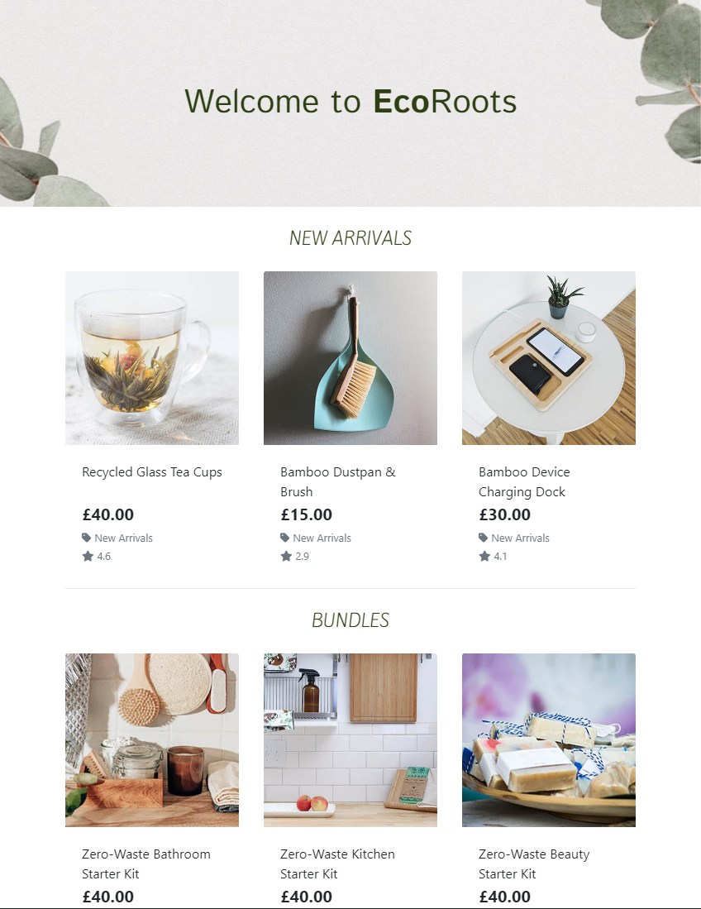
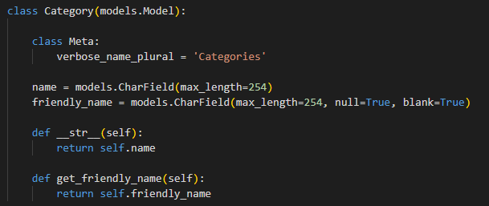
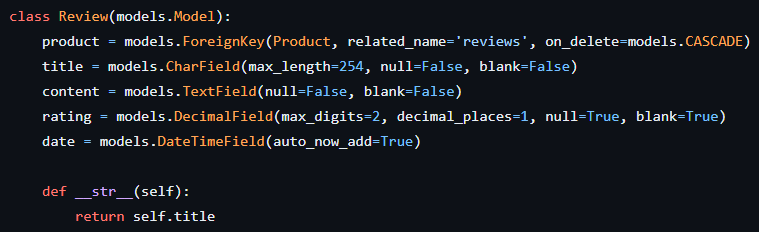
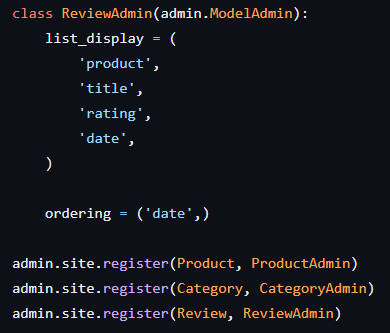
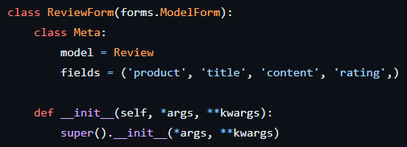
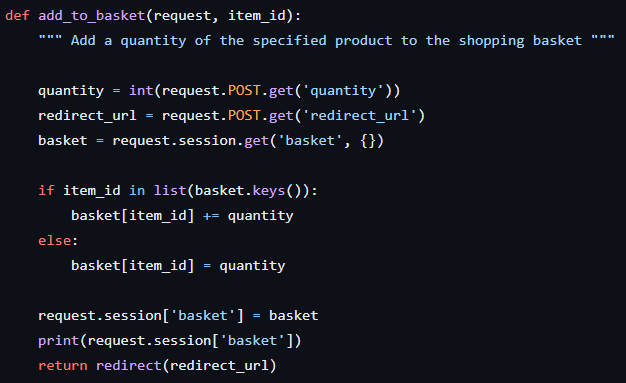
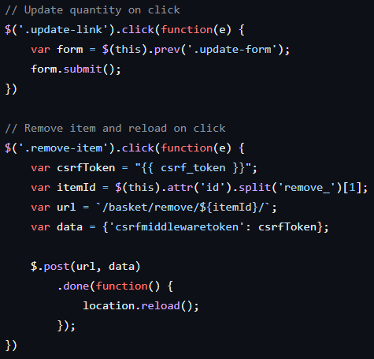
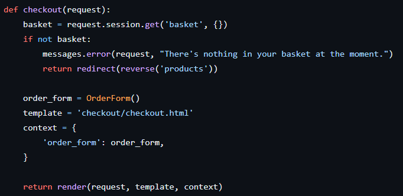
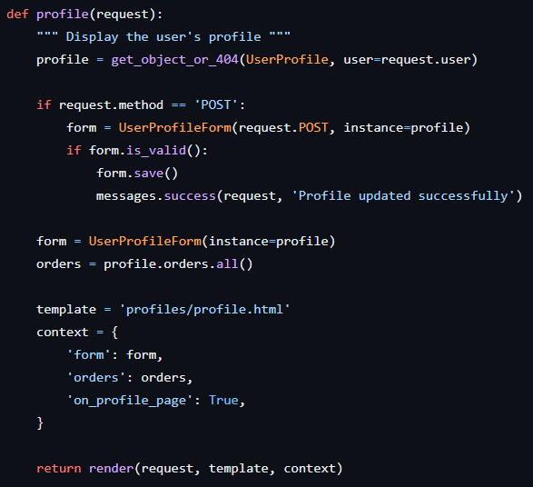

# EcoRoots - *Milestone Project Four*

**Find the final project here:**

## Table of Contents
1. [Project Overview](#project-overview)
2. [User Experience](#user-experience)
3. [Brand Design](#brand-design)
4. [Site Planning](#site-planning)
5. [Data Schema](#data-schema)
6. [Project Management](#project-management)
7. [Site Development & Features](#site-development--features)
    * [Project Setup](#project-setup)
    * [Authentication & Authorisation](#authentication--authorisation)
    * [Base Template](#the-base-template)
    * [Home App](#home-app)
        * [Contact Form](#contact-form)
    * [Products App](#products-app)
        * [Product Filtering & Searching](#product-filtering--searching)
        * [Product Sorting](#product-sorting)
        * [Adding Products](#adding-products)
        * [Modifying Products](#modifying-products)
        * [Product Reviews](#product-reviews)
    * [Basket App](#basket-app)
    * [Checkout App](#checkout)
    * [Messages](#messages)
    * [Profile](#profile)
8. [Testing During Development]()
9. [Pre-Deployment Testing]()
    * [Responsiveness]()
    * [Browser Compatibility]()
    * [Bug Fixes]()
    * [Code Validation]()
    * [User Story Testing]()
    * [Feature Testing]()
10. [Deployment]()
11. [Post-Deployment Testing]()
    * [Responsiveness]()
    * [Browser Compatibility]()
    * [Lighthouse Testing]()
    * [Future Improvements]()
12. [Credits & Acknowledgements](#credits--acknowledgements)

## Project Overview

EcoRoots is an e-commerce website dedicated to offering a curated selection of eco-friendly Beauty, Home, Kitchen & Pet products. The site aims to provide users with a seamless and enjoyable shopping experience while promoting environmentally conscious consumerism.

## User Experience

The key elements of good user experience on an e-commerce site are simplicity, intuitive navigation, and responsiveness. As a minimum, users should be able to easily browse through products and product categories, add items to their cart, and proceed through a secure checkout process. Features such as product reviews, wishlist creation and blog posts can further enhance the user experience.

### Site Goals
EcoRoots has various goals aligned with promoting sustainability, attracting environmentally conscious consumers, and running a successful online business. Here are the site's goals:

- **Promote Sustainable Living:** Encourage and facilitate a more sustainable lifestyle by providing eco-friendly alternatives for everyday beauty, home, kitchen & pet products.

- **Curate a Thoughtful Product Selection:** Create a carefully curated selection of eco-friendly products that meet high standards of sustainability, ethical sourcing, and environmental responsibility.

- **Attract Environmentally Conscious Consumers:** Build a customer base of environmentally conscious individuals who prioritise eco-friendly choices and actively seek products that align with their values.

- **Provide Transparent Information:** Offer transparent and detailed information about product materials, sourcing, and manufacturing processes to build trust with consumers and foster informed decision-making.

- **Encourage Responsible Consumption:** Advocate for responsible consumption by promoting product longevity, reuse, and recycling. Provide information on proper disposal and recycling options for products.

- **Enhance User Experience:** Provide a user-friendly and intuitive online shopping experience that makes it easy for customers to find, purchase, and receive eco-friendly products.

- **Reduce Environmental Impact:** Strive to minimise the environmental impact of the business operations, from sourcing products from local suppliers to reducing the environmental impact of packaging and shipping.

- **Continuous Innovation:** Stay at the forefront of eco-friendly trends and technologies, regularly updating the product range to incorporate the latest sustainable innovations.

### Persona One

**User:** Emma Green, 32

Emma is a marketing professional living in Cardiff. She is passionate about environmental sustainability and actively engages in reducing her ecological footprint. She values transparency, authenticity, and seeks products that align with her eco-friendly lifestyle.

### Emma's Goals:

- **Sustainable Living:** Emma's primary goal is to live a sustainable lifestyle. She aims to minimise waste, choose eco-friendly alternatives, and support companies with environmentally responsible practices.

- **Conscious Consumerism:** Emma wants to make informed choices when purchasing products. She looks for ethical sourcing, fair labour practices, and renewable materials.

- **Discover New Products:** Emma is always on the lookout for innovative and eco-friendly products within the beauty, home & kitchen categories.

- **Convenience:** While being eco-conscious is a priority, Emma also values convenience. She seeks a user-friendly online shopping experience that allows her to quickly find, purchase, and receive eco-friendly products.

### How the Site Can Help Emma:

- **Curated Selection:** The website can provide Emma with a carefully curated selection of eco-friendly and sustainable products. This helps her discover new and innovative items that align with her values.

- **Detailed Product Information:** Emma values transparency. Providing detailed information about each product, including materials, manufacturing processes, and ethical practices, helps her make informed decisions.

- **User Ratings & Reviews:** Emma relies on the opinions of like-minded individuals. Including user ratings and reviews allows her to gauge the authenticity and quality of products from a community perspective.

- **Easy Checkout Process:** A streamlined and secure checkout process is crucial for Emma. Offering multiple payment options and efficient shipping ensures a hassle-free experience.

### Persona Two

**User:** Alex Reed, 36

Alex is a parent of two young children, living in the outskirts of Bath. He is a teacher with a strong commitment to raising environmentally conscious children. Alex is focussed on creating a sustainable lifestyle for his family whilst juggling a busy work and personal schedule.

### Alex's Goals:

- **Sustainable Family Living:** Alex's primary goal is to integrate eco-friendly practices into the family's daily life. This includes choosing sustainable products for the home, reducing waste, and teaching his children about environmental responsibility.

- **Convenience:** With a busy schedule, Alex values efficiency. His goal is to find eco-friendly products quickly without spending too much time browsing through extensive lists.

- **Affordable Options:** While committed to sustainability, Alex is mindful of the budget. Finding affordable eco-friendly alternatives for everyday items is a key consideration.

- **Educational Resources:** Alex wants resources and products that help teach his children about environmental sustainability. Interactive and educational products are of particular interest.

### How the Site Can Help Alex:

- **Family-Focused Categories:** The website can feature family-friendly categories, making it easy for Alex to find eco-friendly products specifically tailored for home, kids, and pets.

- **Budget-Friendly Collections:** Offering curated collections of affordable eco-friendly products helps Alex make sustainable choices without exceeding the family budget.

- **Product Bundles:** The site can offer product bundles that cater to family needs, such as a bundle for eco-friendly kitchen items or a home essentials package.

- **Easy Checkout Process:** A streamlined and secure checkout process is vital for Alex. Offering multiple payment options and efficient shipping ensures a hassle-free experience that fits into his busy schedule.

## Brand Design

### Colours

EcoRoots is centered around sustainable living and conscious consumerism, therefore the colour scheme should be inspired by nature, landscapes and organic elements. The chosen colour scheme was selected because it incorporates both warmer earthy tones with cooler grey tones that can create a minimal but sustainably inspired look for the site.

- **Muted Green (#778C68):** Resembles moss or foliage, adding a natural and calming element.

- **Deep Olive (#2E4013):** Reminiscent of rich, earthy tones, provides depth and compliments the muted green.

- **Light Grey (#D9D9D9):** Introduces a neutral and modern touch, serving as a versatile background or accent colour.

- **Pure White (#FFFFFF):** Adds brightness and crispness to the colour scheme, creating a clean and fresh appearance.

- **Rustic Brown (#591D0F):** Adds contrast and richness, resembling natural wood tones, bringing a touch of warmth.

Before assigning the colours to elements of the site, the colours were tested using Adobe's contrast checker to check the contrast ratios of different combinations.

**1. Muted Green on Deep Olive:** The muted green works well on deep olive as large text or icons, however small text is illegible.

**2. Muted Green on Light Grey:** The muted green does not work well on the light grey, this combination should only be used for large graphic elements.

**3. Muted Green on Pure White:** The muted green works well on pure white as large text or icons, however small text is illegible.

**4. Muted Green on Rustic Brown:** The muted green works well on rustic brown as large text or icons, however small text is illegible.

**5. Deep Olive on Light Grey:** The deep olive works well on light grey as small text, large text or icons, the deep olive could be a good text colour and the light grey could work as a background colour.

**6. Deep Olive on Pure White:** The deep olive works very well on pure white as small text, large text or icons, confirming that the deep olive could be a good text colour.

**7. Deep Olive on Rustic Brown:** The deep olive does not work on rustic brown, therefore this combination should not be used.

**8. Light Grey on Pure White:** The light grey does not work on pure white, therefore this combination should not be used.

**9. Light Grey on Rustic Brown:** The light grey works well on rustic brown as small text, large text or icons, the light grey could be a good text colour on coloured backgrounds.

**10. Pure White on Rustic Brown:** The pure white works well on rustic brown as small text, large text or icons, meaning the pure white could also be a good option for text on coloured backgrounds.

The colour scheme was also tested using Adobe's colour blind checker. The checker found that the deep olive and rustic brown were too similar for users with Deuteranopia. Since this combination also failed the contrast check, it will not be used.

#### Colour Assignments:
- **Muted Green (#778C68):** Header & Footer Background
- **Deep Olive (#2E4013):** Hover Colour
- **Light Grey (#D9D9D9):** Accent Colour & Text/ Icons on Coloured Backgrounds
- **Pure White (#FFFFFF):** Background & Text/ Icons on Coloured Backgrounds
- **Rustic Brown (#591D0F):** Accent Colour & Alternative Hover Colour

### Typography
The chosen fonts for the EcoRoots site are all Google Fonts as they are readily available across most web browsers.

The font pairing for EcoRoots consists of three different fonts: **Istok Web 700, Kite One 400, and Duru Sans 400.**

- **Istok Web 700:** A bold and robust font with a strong, substantial presence. Well-suited for headlines, banners, and elements that require emphasis.

    

- **Kite One 400:** A moderate font, featuring a friendly and modern aesthetic. Suitable for small headings, body text, and paragraphs, it works well for conveying information in a clear and concise manner.

    

- **Duru Sans 400:** A font with a straightforward and modern design. Can be used for both headings and body text as it's neutral design makes it adaptable.

    

## Site Planning

- **Curated Product Selection:**
- **Detailed Product Information:**
- **Family-Focused Categories:**
- **Budget-Friendly Collections:**
- **Product Bundles:**
- **User Reviews and Ratings:**

- **Sustainable Living:**

- **Conscious Consumerism:**

- **Enhance User Experience:**

- **Reduce Environmental Impact:**

- **Continuous Innovation:**

- **Convenience:**

- **Wishlist:**

- **Convenience:**

- **Affordable Options:**
- **User Reviews and Ratings:**
- **Discover New Products:**

- **Green Parenting Guides:**
- **Sustainable Family Living:**
- **Community Engagement:**
- **Educational Content:**

- **Easy Checkout Process:**

### User Stories
User Story ID | User | I Want To Be Able To... | So That I Can ...
:--- | :--- | :--- | :---
**Viewing & Navigation**
1 | Shopper | View a list of products | Select items to purchase
2 | Shopper | View a category of products | Easily find products I'm interested in without having to search through all products
3 | Shopper | View individual product details | Identify the price, description, rating, image, material
4 | Shopper | View product sustainability credentials | Make an informed decision about purchasing a product
5 | Shopper | View product reviews and ratings | Make an informed decision about purchasing a product
6 | Shopper | Identify new product arrivals to the site | See new products that I may want to purchase, being a returning user
7 | Shopper | View the total of my purchases at any time | Avoid spending too much money
8 | Shopper | View bundles of products | Purchase multiple items that are often used together, rather than searching for each individial item
**Registration & User Accounts**
9 | Site User | Easily register for an account | Have a personal account and view my profile
10 | Site User | Easily login or logout | Access my account information
11 | Site User | Easily recover my password if it's forgotten | Regain access to my account
12 | Site User | Receive a confirmation email after registering | Verify that my account was successfully created
13 | Site User | Have a personalised account profile | View my order history, order confirmations, and save delivery information for future purchases
**Sorting & Searching**
14 | Shopper | Sort the available products | Identify the top rated, best price, and latest products from all categories
15 | Shopper | Sort a specific category of product | Identify the top rated, best priced or latest products within a specific category
16 | Shopper | Sort multiple categories of products simultaneously | Find the top rated, best priced or latest products across broader categories
17 | Shopper | Search for a product by name or description | Find a specific product to purchase
18 | Shopper | See what I've searched for and the number of results found | Decide whether the product I'm looking for is available
**Purchasing & Checkout**
19 | Shopper | Easily select the quantity of a product when purchasing it | Ensure I don't accidentally purchase the wrong product or quantity
20 | Shopper | View items in my basket | Identify the total cost of my purchase and the items I will receive
21 | Shopper | Adjust the quantity of individual items in the basket | Make changes to my order before checkout with ease
22 | Shopper | Remove an item from the basket | Easily change what's in my basket if I change my mind or want to keep my order total low
23 | Shopper | Easily enter my delivery and payment information | Have a hassle-free checkout process, if I have information saved to my account I would like it to be pre-filled
24 | Shopper | View an order confirmation after checkout | Verfiy that my order has been processed and is correct
25 | Shopper | Receive a confirmation email after placing an order | Keep the order confirmation for my records
**Interacting with the Store**
26 | Site User | Contact the store with any queries | 
**Admin & Store Management**

**Future Additions (if time)**
22 | Site User | Add items to my wishlist | Save products that I'd like to purchase later

### Wireframes
Considering the site's user stories, wireframes were created of the necessary pages to visualise the user journey through the site as well as plan each page to figure out the amount of work required so the project could be planned accordingly. The decided colour scheme and font pairings were also used in the wireframes to determine a lot of the styling upfront to save time making those decisions during site development.

**Index Page:** The index page consists of a header image and welcome text, followed by two sections containing the latest products added to the site and available bundles of products.

**All Products Page:** The all products page consists of a header showing which category from the navbar they have been directed to. Below the header is filters and a sort feature where users can refine their criteria. This is followed by all the products available on the site that match any criteria the user has set.

**Category Page:** The category page is similar to the all products page, howvever only shows products within a specific category from the navbar. The page header includes a small paragraph with information about the category the user has been directed to.

**Product Detail Page:** The product detail page consists of a large product image along with the product name, description and price. It also includes a form allowing the user to input a quantity and size they would like to purchase with a button to add it to their bag.

**Login Page:** The login page consists of a single form aasking the user to enter their email and password to login to the site. If the user does not already have an account, there is a link below the form that will take them to the registration page where they can create an account. The registration page will be very similar to the login page however will also ask for the user's name.

**Profile Page:** The profile page consists of welcome text in the header, followed by three sections: The user's order history, along with a button to track their orders; their primary address, with an option to edit the address and; their account details, including options to edit or delete their account.

**Shopping Basket Page:** The shopping basket page has a header followed by a table showing the products in the user's basket along with their quantity, size and subtotal. Below the basket is the total price of the basket and two buttons for the user to either keep shopping or continue to the checkout.

**Checkout Page:** Add this after doing the checkout walkthrough tutorial

**Blog Page:** The blog page is a very simple page consisting of multiple blog post previews divided into columns depending on the screen size, each preview can be clicked on to direct the user to the detailed blog posts.

### App Planning

The EcoRoots site will consist of multiple Django apps that allow it to function as desired.

- **Home**: The home app will run the index page.
- **Products**: The products app will run the product database and any pages that show products on them such as the subcategory pages.
- **Basket:**
- **Checkout:**
- **Blog:**

### Data Schema

SQL will be used in this project to create a relational database system containing the details needed for the EcoRoots application. The tables that would be needed for the EcoRoots database were planned out before beginning any site development. By doing this thinking upfront rather than during site development this should help visualise the amount of work required on the database working as well as prevent updates being needed after the database has been created.

Below is a visualisation of the tables needed for the minimum viable application. The first table is the categories table, each category will have an id (the primary key), name and a friendly name that is readable to the user. Next is the products table, each product on the site will have a sku (the primary key), category (the foreign key that links the product to the categories table), name, description, price, rating, image url and image. The final table is the users table, this is where user's information from registration will be stored, which is the user id (the primary key), email, password (which will be hashed) and name.

## Project Management

### Languages Used
- HTML5
- CSS3
- JavaScript
- Python

### Version Control
During the development of the EcoRoots site, GitHub was used to manage versions of each file. Commits were made often and consisted of one feature implementation or edit so it would be easier to roll back to a previous version if required. In total, there were ?? commits for this project. Details of the commits can be found here: https://github.com/Renz2299/mp4_eco_roots/commits/main

## Site Development & Features

### Project Setup

**Commits from 22nd Dec:**

- First, the repositiory was created on GitHub using the Code Institute GitPod template and then opened in GitPod. To create a new django project the command 'python3 django-admin startproject' was used to create the project folder and initial python files.

### Authentication & Authorisation

**Commits from 22nd Dec:**

For user authenication in this project, django-allauth was used. To setup allauth it first had to be installed used the command 'pip3 install django-allauth'. After installing allauth, all the projects requirements were now installed, therefore the versions were frozen into the requirements.txt file using 'pip3 freeze -r requirements.txt'.

Next, some changes were required to the settings.py and urls.py files. Within the settings.py file, allauth needed adding to the installed apps and some requirements from the allauth documentation was also needed, these were copied directly from the documentation to ensure they were correct.

Finally, within the urls.py file a new account path was required to show the allauth urls. This allows for any allauth templates to be rendered when on the accounts/ path.

**Commits from 8th Jan:**

Once the base template was complete, the allauth templates were updated to extend the base template so any user authentication pages also had the site navigation and footer to remain in keeping with the rest of the site.

This was done by firstly updating the allauth base template to extend the site base template and include the header container to push the page content beneath the navigation. A block called 'inner_content' was added to another container to house the specific allauth template page content.

All allauth templates were then updated to extend the allauth base template within the allauth/account folder. And the content blocks on these pages were updated to 'inner_content'

### The Base Template

**Commits from 23rd Dec:**

Now that allauth is setup and working, the required allauth templates needed adding to the project. To do this the command 'cp -r ../.pip-modules/lib/python3.9/site-packages/allauth/templates/* ./templates/allauth/' was used. This installed the allauth templates and the final section of the command after the space allowed them to be saved in the correct place within the file structure. Only the account and socialaccount templates were required for customising, so the rest were deleted as allauth can access them directly instead.

Next, the base template was created within the project templates folder. This html file is currently very basic, only containing a head element and within the body a header and single container. Blocks were added to separate out the code so it could be added to within other templates where required. Within the head element the content was split into meta, css and js block along with extra ones for each where required within the project. Within the body, a message container was created within an 'if messages' block followed by two blocks for the page header and content and finally a block for any javascript that can be loaded after the rest of the page.

**Commits from 2nd & 7th Jan:**

CSS and JavaScript links were added to the top of the base template so they would be available across all site pages. These links were to the base.css file within the project's static folder; the Google Fonts css for the specific fonts that will be used throughout the site and; the script tag for Font Awesome icons.

The top navbar was added to the base template including the site logo, the account link, the search bar and the basket along with the grand total.

The main navigation and mobile top header were added to an includes folder within the site templates folder and they can be accessed via an includes tag in the base template.

After focussing on other functionality within the site, bootstrap display classes were used to hide certain elements on certain screen sizes. This was because on small screens the main navigation is accessed via the navbar toggler and the account, search and basket links move down to where the main navigation was on larger screens. Also, the correct site colours were added to the navigation through the base.css file.

### Home App

**Commits from 23rd Dec:**

The home app was created using the command 'mkdir -p startapp home'. To setup the home app, it was added to the installed apps within the settings.py file and a path was added to the project urls.py file. Then the index.html file was created within the home/templates/home folder including a single h1 saying 'It Works!' simply to test that the home app is setup and working correctly when running the server. To allow the index page to render a view was added to the home/views.py file called 'index' and this path was included within the home/urls.py file.

**Commits from 2nd Jan:**

Within the settings.py file, the media root was setup so that when any media is required, it could be easily accessed across the site rather than manually including the source for each image element.

**Commits from 3rd Jan:**

Once the navigation was setup correctly on each screen width, the header-container could be given a set height so that page content could be pushed below the navigation rather than being hidden behind it.

**Commits from 6th Jan:**

Within the index view in views.py two new variables were added to get the products from the new_arrivals and bundles categories. These varibles were then added to the context and passed to the template when the index view is called. They are then rendered within their own sections of the index page.

#### Contact Form

**Commits from 14th Jan:**

Contact form, view and template created along with overview for superusers

### Products App

**Commits from 3rd Jan:**

The products app was created using the command 'python3 manage.py startapp products' in the terminal. It was then added to the installed apps within the settings.py and a path was created witin the product app urls.py file.

After setting up the products app, the Product and Category model were created in the products app models.py file.

To populate these models, json files were created including all the data for the 6 categories and the 47 products that would initially be on the site.

The categories were manually written. The product details were created using ChatGPT to suggest product names, descriptions and prices. The images for the products were found from a mixture of image sites including Unsplash, Freepik and ...

The data was gathered into an excel file and exported as a CSV before formatting it with an online json formatter.

Next, the models could now be migrated. The dry-run and plan flags were used to check the migrations about to be made were correct. These are the commands and order they were used in:
1. 'python3 manage.py makemigrations --dry-run'
2. 'python3 manage.py makemigrations'
3. 'python3 manage.py migrate --plan'
4. 'python3 manage.py migrate'

**Details about importing the fixtures**

After migrating the models, they were double checked in the site admin to ensure they could be accessed properly. From doing this a few changes were needed to make the admin view of the Product and Category models more user friendly.

The list of fields displayed was updated to show the data in the table overview of both models.

Next, the all_products view was created to send all products to the product template so they could be rendered on the page. The products url was also added to the products app urls.py file.

To render the products appropriately on the page, the products template was updated so that for every product passed to the template it would render a card showing the product image, name, price, rating and category.

**Commits from 4th Jan:**

A specific product's details can be accessed by clicking the product's image within the all products page. This takes the user to the product_detail page. On this page are two bootstrap columns, the first including the product image and the second showing the product name, description, rating and price.

Within the products views.py a view was added for the product_detail where it would pass the specific product's id to the template.

This view and url path was also added the products app urls.py file.

**Commits from 5th Jan:**

To enhance the user experience of the site on longer site pages, a back to top button was added to the bottom right-hand corner of the products template. This was done using a small amount of JavaScript at the bottom of the products.html template.

A quantity option was also added to the product detail page so the user could increase or decrease the quantity they would like to add to their basket. This was also done using JavaScript ...

**Commits from 7th Jan:**

The final element of the products app was to show the category title and description at the top of the products page.

To do this an if, elif, else statement was included within the products template to determine which category the user was viewing and render the appropriate title and description for the category.

Looking back at this addition, it would have been easier and cleaner to include a description within the Category model that could be accessed from the products template. If there is time towards the end of the project, this may be implemented.

#### Product Filtering & Searching

**Commits from 4th Jan:**

Search functionality was added to the products view through a number of if statements looking for a query within the get request and then filtering all products by determining if that query is in the product name or description and returning the filtered products to the template.

Category filtering was also done using if statements to first determine if 'category' was in the get request and then taking the category or categories minus any commas and filtering the products based on those categories. They are then passed to the template to be rendered.

#### Product Sorting

**Commits from 5th Jan:**

The sort functionality was added to the product view and first looks at what it's being sorted by and assigns it to the sortkey. It then checks if there is a direction to the sort and will arrange the sortkey either ascending or descending.

#### Adding Products

**Commits froms 14th Jan:**

Add product form and functionality

#### Modifying Products

**Commits froms 14th Jan:**

Edit product form and functionality

Delete products functionality

Securing add, edit and delete views

#### Product Reviews

**Commits froms 14th Jan:**

A later addition to the products app was the ability to read and add product reviews. For this a Review model was created with the products app models.py file. This model contains the product as the foreign key along with a title, content and rating for the review. This model was then registered in the products admin.py file and a review was created in the site admin to test it was working correctly.

After creating this model, migrations were made to ensure it could be accessed correctly.

Next, the ability for a user to add a review was added to the products views.py file so that when a user chooses to add a product review from the product detail page they are directed to a review form. The form was added to the forms.py file within the products app and then the view for adding a product was duplicated and customised to fit the function of adding a review.

Reviews model created - Small bug still to fix

### Basket App

**Commits from 5th Jan:**

The basket app was created using the command 'python3 manage.py startapp basket' in the terminal. It was then added to the installed apps within the settings.py and a path was created witin the basket app urls.py file.

A basket_contents view was added to the basket views.py to get the products that the user has added to their basket so they could be added to the context and passed to the basket template.

The delivery logic was also added to this view to determine the free_delivery_delta and inform the customer of whether they have free delivery or how much more they need to spend to get free delivery.

Finally, the total of the basket content and delivery are added together to get the grand total of the user's basket.

Next the add to basket functionality was added to the basket views.py. This view takes the item id of the product being added and looks for the quantity being added. If the item is already in the basket it will update the quantity in the basket, otherwise it will add the item to the basket.

Within the basket, the update and remove options were added to each product line within the basket. This was done using JavaScript at the bottom of the basket template. The update function takes the quantity value and updates it within the basket. The remove function removes the specific product from the basket.

**Commits from 6th Jan:**

basket_tools to handle calculating line subtotal

### Checkout

**Commits from 6th Jan:**

The checkout app was created using the command 'python3 manage.py startapp checkout' in the terminal. It was then added to the installed apps within the settings.py and a path was created witin the checkout app urls.py file.

The checkout view takes the users basket and creates an order form for that basket from the checkout forms.py file.

The OrderForm is a django form containing the available fields necessary for the user to place an order.

OrderLineItemAdminInLine and OrderAdmin were added to the checkout admin.py file to ensure the correct fields submitted by the user when they place an order remain read only so they cannot be edited.

Finally, a signals.py file was created within the checkout app to ensure that the order would be updated or deleted depending on edits made within the site admin.

**Commits from 8th Jan:**

The payment functionality on the site is handled using Stripe payments. For this a stripe_elements.js file was created within the checkout app to create the stripe elements and mount them to card element within the checkout template.

Error handling was also added to this file to ensure any errors with the card element are signposted to the user.

To handle the submit button for the payment form, an event listener was added to the button and upon clicking this the ability to edit the form or click the button again is disabled whilst the details are checked by Stripe.

If there is an error this is signposted to the user and the form is re-enabled so they can make the required changes.

If this is successful, the form is submitted and the payment is succeeded.

Finally, the required stripe public key and secret key was added to the settings.py file so it could be accessed across the site.

To get the checkout functionality working, the checkout url and checkout success url were added to checkout urls.py file.

The checkout_success view was created to handle successful checkouts. It gets the order number from the order and returns it to the user in a toast message. And then deletes the basket from the session. It then returns the order context to the template to be rendered on the page.

**Commits from 9th Jan:**

Upon submitting the payment form an overlay is added to the page with a loading spinner in the centre.

A checkout success template was created to take the order information passed to it from the view and render it to the user in a table.

A small amount of webhook handling was included, however this was not specified in the project criteria, therefore will only be revisited if time at the end of the project.

**Commits from 14th Jan:**

Env variables setup

### Messages

**Commits from 6th Jan:**

Toast messages were added to signpost users throughout the site based on their actions.

Within the templates/includes folder, a new folder was created for toasts to include the html files for the four different kinds of toast messages.

At the bottom of the base template an if, elif, else statement was added to determine which toast message should be shown to the user depending on it's level.

Finally, the JavaScript for toasts was added to the very bottom of the base template in the postloadjs block.

### Profile

**Commits from 9th Jan:**

The profile app was created using the command 'python3 manage.py startapp profile' in the terminal. It was then added to the installed apps within the settings.py and a path was created witin the profile app urls.py file.

The UserProfile model was added to the models.py file within the profile app. This model includes a one to one field linking it to the User model. It also includes default delivery fields that the user can add if they wish to save their information for a faster checkout process.

The UserProfile model view was tested by getting the user and sending it to the template. And then rendering the username on the profile.html page.

**Commits from 14th Jan:**

Added profile form and views

Added order history, save info functionality

## Bug Fixes

Footer not staying at bottom of page

## Credits & Acknowledgements

DEBUG = int(os.environ.get("DEVELOPMENT", default=0))

Mockups for renders <a href="https://www.freepik.com/free-vector/digital-device-mockup-set_4122518.htm#query=device%20mockup&position=8&from_view=search&track=ais&uuid=2c6b5773-48a8-4b9a-b8a0-4b83164331af">Image by rawpixel.com</a> on Freepik

No image found image = Image by <a href="https://www.freepik.com/free-vector/realistic-question-box-mockup_28846681.htm#query=mystery&position=1&from_view=search&track=sph&uuid=3ddffba5-4263-4cdb-8308-d88d826b07f6">Freepik</a>

Come back to this for updating anything in json files

reset password page not styled the same

DONE delete product needs pop-up for confirmation - Modal

qty buttons not working

To implement into final deployed database product descriptions:

- **Provide Transparent Information:** Offer transparent and detailed information about product materials, sourcing, and manufacturing processes to build trust with consumers and foster informed decision-making.

- **Encourage Responsible Consumption:** Advocate for responsible consumption by promoting product longevity, reuse, and recycling. Provide information on proper disposal and recycling options for products.

- **Reduce Environmental Impact:** Strive to minimise the environmental impact of the business operations, from sourcing products from local suppliers to reducing the environmental impact of packaging and shipping.