# EcoRoots - *Milestone Project Four*

**Find the final project here:**

## Table of Contents
1. [Project Overview](#project-overview)
2. [User Experience](#user-experience)
3. [Brand Design](#brand-design)
4. [Site Planning](#site-planning)
5. [Data Schema](#data-schema)
6. [Project Management](#project-management)
7. [Site Development & Features](#site-development--features)
    * [Project Setup](#project-setup)
    * [Authentication & Authorisation](#authentication--authorisation)
    * [Base Template](#the-base-template)
    * [Home App](#home-app)
        * [Contact Form](#contact-form)
    * [Products App](#products-app)
        * [Product Filtering & Searching](#product-filtering--searching)
        * [Product Sorting](#product-sorting)
        * [Adding & Modifying Products](#adding--modifying-products)
        * [Product Reviews](#product-reviews)
    * [Basket App](#basket-app)
    * [Checkout App](#checkout)
    * [Messages](#messages)
    * [Profile](#profile)
8. [Testing During Development](#testing-during-development)
9. [Pre-Deployment Testing](#pre-deployment-testing)
    * [Responsiveness](#responsiveness)
    * [Browser Compatibility](#browser-compatibility)
    * [Code Validation](#code-validation)
    * [User Story Testing](#user-story-testing)
    * [Feature Testing](#feature-testing)
10. [Deployment](#deployment)
11. [Post-Deployment Testing](#post-deployment-testing)
    * [Responsiveness](#responsiveness-1)
    * [Browser Compatibility](#browser-compatibility-1)
    * [Lighthouse Testing](#lighthouse-testing)
    * [Future Improvements](#future-improvements)
12. [Credits & Acknowledgements](#credits--acknowledgements)

## Project Overview

EcoRoots is an e-commerce website dedicated to offering a curated selection of eco-friendly Beauty, Home, Kitchen & Pet products. The site aims to provide users with a seamless and enjoyable shopping experience while promoting environmentally conscious consumerism.

## User Experience

The key elements of good user experience on an e-commerce site are simplicity, intuitive navigation, and responsiveness. As a minimum, users should be able to easily browse through products and product categories, add items to their cart, and proceed through a secure checkout process. Features such as product reviews, wishlist creation, contact forms and blog posts can further enhance the user experience.

### Site Goals
EcoRoots has various goals aligned with promoting sustainability, attracting environmentally conscious consumers, and running a successful online business. Here are the site's goals:

- **Promote Sustainable Living:** Encourage and facilitate a more sustainable lifestyle by providing eco-friendly alternatives for everyday beauty, home, kitchen & pet products.

- **Curate a Thoughtful Product Selection:** Create a carefully curated selection of eco-friendly products that meet high standards of sustainability and environmental responsibility.

- **Attract Environmentally Conscious Consumers:** Build a customer base of environmentally conscious individuals who prioritise eco-friendly choices and actively seek products that align with their values.

- **Provide Transparent Information:** Offer transparent and detailed information about products to build trust with consumers and foster informed decision-making.

- **Encourage Responsible Consumption:** Advocate for responsible consumption by promoting product longevity and reuse.

- **Enhance User Experience:** Provide a user-friendly and intuitive online shopping experience that makes it easy for customers to find, purchase, and receive eco-friendly products.

- **Continuous Innovation:** Stay at the forefront of eco-friendly trends and technologies, regularly updating the product range to incorporate the latest sustainable innovations.

### Persona One

**User:** Emma Green, 32

Emma is a marketing professional living in Cardiff. She is passionate about environmental sustainability and actively engages in reducing her ecological footprint. She values transparency, authenticity, and seeks products that align with her eco-friendly lifestyle.

### Emma's Goals:

- **Sustainable Living:** Emma's primary goal is to live a sustainable lifestyle. She aims to minimise waste, choose eco-friendly alternatives, and support companies with environmentally responsible practices.

- **Conscious Consumerism:** Emma wants to make informed choices when purchasing products. She looks for ethical sourcing, fair labour practices, and renewable materials.

- **Discover New Products:** Emma is always on the lookout for innovative and eco-friendly products within the beauty, home & kitchen categories.

- **Convenience:** While being eco-conscious is a priority, Emma also values convenience. She seeks a user-friendly online shopping experience that allows her to quickly find, purchase, and receive eco-friendly products.

### How the Site Can Help Emma:

- **Curated Selection:** The website can provide Emma with a carefully curated selection of eco-friendly and sustainable products. This helps her discover new and innovative items that align with her values.

- **Detailed Sustainability Information:** Emma values transparency. Providing detailed information about the company's product sourcing and ethical practices, helps her make informed decisions.

- **User Ratings & Reviews:** Emma relies on the opinions of like-minded individuals. Including user ratings and reviews allows her to gauge the authenticity and quality of products from a community perspective.

- **Easy Checkout Process:** A streamlined and secure checkout process is crucial for Emma. Offering multiple payment options and efficient shipping ensures a hassle-free experience.

### Persona Two

**User:** Alex Reed, 36

Alex is a parent of two young children, living in the outskirts of Bath. He is a teacher with a strong commitment to raising environmentally conscious children. Alex is focussed on creating a sustainable lifestyle for his family whilst juggling a busy work and personal schedule.

### Alex's Goals:

- **Sustainable Family Living:** Alex's primary goal is to integrate eco-friendly practices into his family's daily life. This includes choosing sustainable products for the home, reducing waste, and teaching his children about environmental responsibility.

- **Convenience:** With a busy schedule, Alex values efficiency. His goal is to find eco-friendly products quickly without spending too much time browsing through extensive lists.

- **Affordable Options:** While committed to sustainability, Alex is mindful of the budget. Finding affordable eco-friendly alternatives for everyday items is a key consideration.

- **Discover New Products:** Alex is looking for innovative and eco-friendly products within the home & kitchen categories to help teach his children about sustainable living.

### How the Site Can Help Alex:

- **Budget-Friendly Collections:** Offering curated collections of affordable eco-friendly products helps Alex make sustainable choices without exceeding the family budget.

- **Product Bundles:** The site can offer product bundles that cater to family needs, such as a bundle for eco-friendly kitchen items or a home essentials package.

- **New Products:** Alex can find new products easily from home page, helping him discover new and innovative items that can teach his family about sustinable living.

- **Easy Checkout Process:** A streamlined and secure checkout process is vital for Alex. Offering multiple payment options and efficient shipping ensures a hassle-free experience that fits into his busy schedule.

## Brand Design

### Colours

EcoRoots is centered around sustainable living and conscious consumerism, therefore the colour scheme should be inspired by nature, landscapes and organic elements. The chosen colour scheme was selected because it incorporates both warmer earthy tones with cooler grey tones that can create a minimal but sustainably inspired look for the site.

- **Muted Green (#778C68):** Resembles moss or foliage, adding a natural and calming element.

- **Deep Olive (#2E4013):** Reminiscent of rich, earthy tones, provides depth and compliments the muted green.

- **Light Grey (#D9D9D9):** Introduces a neutral and modern touch, serving as a versatile background or accent colour.

- **Pure White (#FFFFFF):** Adds brightness and crispness to the colour scheme, creating a clean and fresh appearance.

- **Rustic Brown (#591D0F):** Adds contrast and richness, resembling natural wood tones, bringing a touch of warmth.

Before assigning the colours to elements of the site, the colours were tested using Adobe's contrast checker to check the contrast ratios of different combinations.

**1. Muted Green on Deep Olive:** The muted green works well on deep olive as large text or icons, however small text is illegible.

**2. Muted Green on Light Grey:** The muted green does not work well on the light grey, this combination should only be used for large graphic elements.

**3. Muted Green on Pure White:** The muted green works well on pure white as large text or icons, however small text is illegible.

**4. Muted Green on Rustic Brown:** The muted green works well on rustic brown as large text or icons, however small text is illegible.

**5. Deep Olive on Light Grey:** The deep olive works well on light grey as small text, large text or icons, the deep olive could be a good text colour and the light grey could work as a background colour.

**6. Deep Olive on Pure White:** The deep olive works very well on pure white as small text, large text or icons, confirming that the deep olive could be a good text colour.

**7. Deep Olive on Rustic Brown:** The deep olive does not work on rustic brown, therefore this combination should not be used.

**8. Light Grey on Pure White:** The light grey does not work on pure white, therefore this combination should not be used.

**9. Light Grey on Rustic Brown:** The light grey works well on rustic brown as small text, large text or icons, the light grey could be a good text colour on coloured backgrounds.

**10. Pure White on Rustic Brown:** The pure white works well on rustic brown as small text, large text or icons, meaning the pure white could also be a good option for text on coloured backgrounds.

The colour scheme was also tested using Adobe's colour blind checker. The checker found that the deep olive and rustic brown were too similar for users with Deuteranopia. Since this combination also failed the contrast check, it will not be used.

#### Colour Assignments:
- **Muted Green (#778C68):** Header & Footer Background
- **Deep Olive (#2E4013):** Hover Colour
- **Light Grey (#D9D9D9):** Accent Colour & Text/ Icons on Coloured Backgrounds
- **Pure White (#FFFFFF):** Background & Text/ Icons on Coloured Backgrounds
- **Rustic Brown (#591D0F):** Accent Colour & Alternative Hover Colour

### Typography
The chosen fonts for the EcoRoots site are all Google Fonts as they are readily available across most web browsers.

The font pairing for EcoRoots consists of three different fonts: **Istok Web 700, Kite One 400, and Duru Sans 400.**

- **Istok Web 700:** A bold and robust font with a strong, substantial presence. Well-suited for headlines, banners, and elements that require emphasis.

    

- **Kite One 400:** A moderate font, featuring a friendly and modern aesthetic. Suitable for small headings, body text, and paragraphs, it works well for conveying information in a clear and concise manner.

    

- **Duru Sans 400:** A font with a straightforward and modern design. Can be used for both headings and body text as it's neutral design makes it adaptable.

    

## Site Planning

### User Stories
User Story ID | User | I Want To Be Able To... | So That I Can ...
:--- | :--- | :--- | :---
**Viewing & Navigation**
1 | Shopper | View a list of products | Select items to purchase
2 | Shopper | View a category of products | Easily find products I'm interested in without having to search through all products
3 | Shopper | View individual product details | Identify the price, description, rating, image, reviews if available
4 | Shopper | View product and company sustainability credentials | Make an informed decision about purchasing from the store or purchasing a specific product
5 | Shopper | View product reviews and ratings | Make an informed decision about purchasing a product
6 | Shopper | Identify new product arrivals to the site | See new products that I may want to purchase, being a returning user
7 | Shopper | View the total of my purchases at any time | Avoid spending too much money
8 | Shopper | View bundles of products | Purchase multiple items that are often used together, rather than searching for each individial item
**Registration & User Accounts**
9 | Site User | Easily register for an account | Have a personal account and view my profile
10 | Site User | Easily login or logout | Access my account information
11 | Site User | Easily recover my password if it's forgotten | Regain access to my account
12 | Site User | Have a personalised account profile | View my order history, order confirmations, and save delivery information for future purchases
**Sorting & Searching**
13 | Shopper | Sort the available products | Identify the top rated, best price, and latest products from all categories
14 | Shopper | Sort a specific category of product | Identify the top rated, best priced or name alphabetically
15 | Shopper | Sort multiple categories of products simultaneously | Find the top rated, best priced, name or category alphabetically across broader categories
16 | Shopper | Search for a product by name or description | Find a specific product to purchase
17 | Shopper | See what I've searched for and the number of results found | Decide whether the product I'm looking for is available
**Purchasing & Checkout**
18 | Shopper | Add items to my basket and the desired quantity | Purchase the products I would like and multiples of the product I would like
19 | Shopper | View items in my basket | Identify the total cost of my purchase and the items I will receive
20 | Shopper | Easily update the quantity of a product in the basket | Make changes to my order before checkout
21 | Shopper | Remove an item from the basket | Easily change what is in my basket if I change my mind or want to keep my order total low
22 | Shopper | Easily enter my delivery and payment information | Have a hassle-free checkout process, if I have information saved to my account I would like it to be pre-filled
23 | Shopper | View details about any errors when handling delivery and payment information | To see if I have entered something incorrectly or to contact the store for more complex problems
24 | Shopper | View an order confirmation after checkout | Verfiy that my order has been processed and is correct
**Interacting with the Store**
25 | Site User | Contact the store with any queries | If I am logged in and have information saved I would like it to be pre-filled in the form
26 | Shopper | Add reviews to products I have purchased | Help other shoppers make informed decisions before purchasing the product
**Admin & Store Management**
27 | Store Owner | Add a product | Update the store's product collection and introduce new products to our customers
28 | Store Owner | Edit a product's details | Update prices to stay competitive and refresh product images, names or descriptions and correct any information if necessary
29 | Store Owner | Delete a product | Remove a product from the store if it has been discontinued or is out of stock
30 | Store Owner | View contact requests | Read customer queries and reply to them via email
**Future Additions (if time)**
31 | Site User | Receive a confirmation email after registering | Verify that my account was successfully created
32 | Site User | Add items to my wishlist | Save products that I'd like to purchase later
33 | Shopper | Receive a confirmation email after placing an order | Keep the order confirmation for my records

### Wireframes
Considering the site's user stories, wireframes were created of the necessary pages to visualise the user journey through the site as well as plan each page to figure out the amount of work required so the project could be planned accordingly. The decided colour scheme and font pairings were also used in the wireframes to determine a lot of the styling upfront to save time making those decisions during site development.

**Index Page:** The index page consists of a header image and welcome text, followed by two sections containing the latest products added to the site and available bundles of products.

**All Products Page:** The all products page consists of a header showing which category from the navbar they have been directed to. Below the header is filters and a sort feature where users can refine their criteria. This is followed by all the products available on the site that match any criteria the user has set.

**Category Page:** The category page is similar to the all products page, howvever only shows products within a specific category from the navbar. The page header includes a small paragraph with information about the category the user has been directed to.

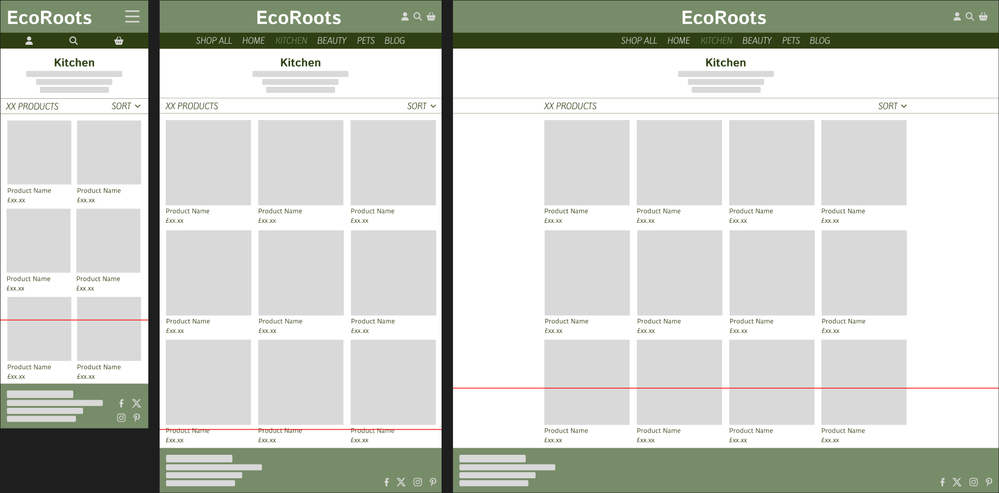

**Product Detail Page:** The product detail page consists of a large product image along with the product name, description and price. It also includes a form allowing the user to input a quantity they would like to purchase with a button to add it to their bag or continue shopping. Beneath the product details are the reviews related to that product.

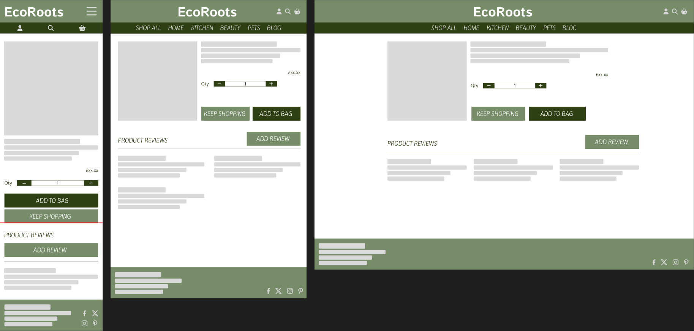

**Profile Page:** The profile page consists of welcome text in the header, followed by three sections: The user's order history; their primary address, with an option to edit the address and; their account details.

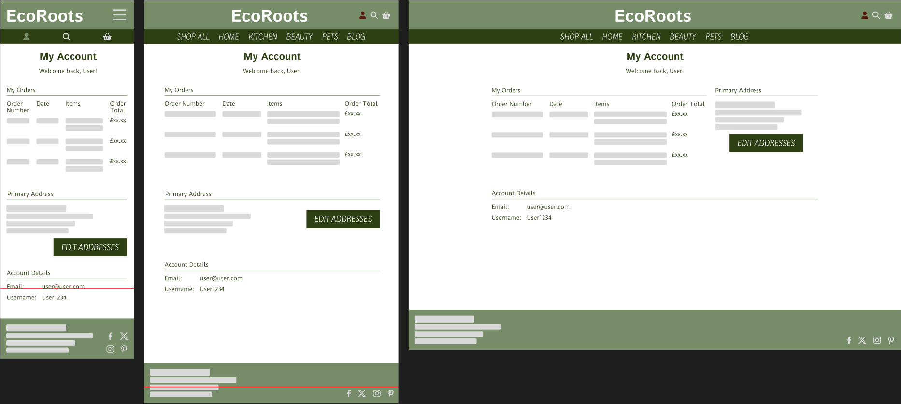

**Shopping Basket Page:** The shopping basket page has a header followed by a table showing the products in the user's basket along with their quantity, size and subtotal. Below the basket is the total price of the basket and two buttons for the user to either keep shopping or continue to the checkout.

**Checkout Page:** Add this after doing the checkout walkthrough tutorial

**Authentication & Authorisation Pages:** Django Allauth will be used to handle authenticating and authorising users on the site. Therefore the layout of these pages will remain very similar to the allauth templates however the styling will be updated to match the rest of the site.

### App Planning

The EcoRoots site will consist of multiple Django apps that allow it to function as desired.

- **Home**: The home app will run the index page as well as the contact form and other simple pages linked from the site footer.
- **Products**: The products app will run the product database and any pages that show products on them as well as handle the CRUD functionality for the product database such as adding a new product or editing an existing product.
- **Profiles:** The profiles app will handle viewing and interacting with the user profile page and each user's data.
- **Basket:** The basket app will run the shopping basket and handle CRUD functionality within the basket.
- **Checkout:** The checkout app will handle checkout functionality using Stripe as well as successful checkouts leading to an order confirmation page.

### Data Schema

SQL will be used in this project to create a relational database system containing the details needed for the EcoRoots application. The tables that would be needed for the EcoRoots database were planned out before beginning any site development. By doing this thinking upfront rather than during site development this should help visualise the amount of work required on the database working as well as prevent updates being needed after the database has been created.

Below is a visualisation of the tables needed for the minimum viable application.

**Reviews:** The reviews table houses product reviews added by shoppers that relate to each product. This table consists of a product field (the foreign key that links the review to a product), title, content, rating and the date the review was added to the site.

**Products:** The products table consists of a product id (the primary key), sku, name, description, price, category (the foreign key that links the product to the categories table), rating and image.

**Categories:** The categories table consists of a category id (the primary key), name and friendly name that is readable to the user.

**OrderLineItem:** The orderlineitem table creates a total cost for a single product line on an order. It consists of the order field (the foreign key that links the lineitem_totals to the order table), product (another foreign key that links to the product id on the product table), quantity and lineitem_total.

**Orders:** The orders table contains all order information. This table consists of an order_number (the foreign key that links to the orderlineitem table), userprofile (the foreign key that links to the userprofile table), full name, email (which can be taken from the users table if it exists), delivery information (which can be taken from the userprofile table if it exists), date, delivery cost, order total and grand total.

**UserProfile:** The user profile table allows the user's default delivery information to be saved to their profile. The table consists of the user (the foreign key linking the userprofile to a specific user) and the user's default delivery information.

**Users:** The users table, where user's information from registration will be stored, consists of the user id (the primary key), username, email and password. Since this project will be using Django Allauth, the user passwords will not be stored in the database, therefore cannot be accessed via the admin.

**Contact:** The contact table is intended for users to send contact requests to the store. This table consists of a name field, email field, the contact request content and the date it was sent on.

## Project Management

### Languages Used
- HTML5
- CSS3
- JavaScript
- Python

### Version Control
During the development of the EcoRoots site, GitHub was used to manage versions of each file. Commits were made often and consisted of one feature implementation or edit so it would be easier to roll back to a previous version if required. In total, there were ?? commits for this project. Details of the commits can be found here: https://github.com/Renz2299/mp4_eco_roots/commits/main

## Site Development & Features

### Project Setup

**Commits from 22nd Dec:** First, the repository was created on GitHub using the Code Institute GitPod template and opened in GitPod. To create a new django project the command 'python3 django-admin startproject' was used to create the project folder and initial python files.

### Authentication & Authorisation

**Commits from 22nd Dec:**

For user authenication in this project, django-allauth was used. To setup allauth it first had to be installed using the command 'pip3 install django-allauth'. After installing allauth, all the project's requirements were frozen into a requirements.txt file using 'pip3 freeze -r requirements.txt'.

The allauth apps needed adding to the installed apps in the settings.py file, and some requirements from the allauth documentation were also needed, these were copied directly from the documentation to ensure they were correct.

In the urls.py file a new account path was required to show the allauth urls. This allows for any allauth templates to be rendered when on the accounts/ url path.

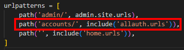

**Commits from 23rd Dec:**

The required allauth templates needed adding to the project. To do this the command 'cp -r ../.pip-modules/lib/python3.9/site-packages/allauth/templates/* ./templates/allauth/' was used. This installed the allauth templates and the final section of the command after the space allowed them to be saved in the correctly within the file structure. Only the account and socialaccount templates were required for customising, so the rest were deleted as allauth can access them directly instead.

**Commits from 8th Jan:**

Once the base template was complete, the allauth templates were updated to extend the base template so they also had the site navigation and footer. This was done by first updating the allauth base template to extend the site base template and include the header container to push the page content beneath the navigation. A block called 'inner_content' was added to another container for the specific allauth template page content.

### The Base Template

**Commits from 23rd Dec:**

The base template was created within the project templates folder. Blocks were added to separate out the code so it could be added to within other templates where required. Within the head element the content was split into meta, css and js block along with extra ones for each where required within the project. Within the body, a message container was created within an 'if messages' block followed by two blocks for the page header and content and finally a block for any javascript that can be loaded after the rest of the page.

**Commits from 2nd Jan:**

CSS and JavaScript links were added to the top of the base template so they would be available across all site pages. These links were to the base.css file within the project's static folder; the Google Fonts css for the specific fonts that will be used throughout the site and; the script tag for Font Awesome icons.

The top navbar was added to the base template including the site logo, the account link, the search bar and the basket along with the grand total.

The main navigation and mobile top header were added to an includes folder within the site templates folder and they can be accessed via an includes tag in the base template.

**Commits from 7th Jan:**

After focussing on other functionality within the site, bootstrap display classes were used to hide certain elements of the navigation on certain screen sizes. This was because on small screens the main navigation is accessed via the navbar toggler and the account, search and basket links move down to where the main navigation is on larger screens. Also, the correct site colours were added to the navigation through the base.css file.

### Home App

**Commits from 23rd Dec:**

The home app was created using the command 'mkdir -p startapp home'. To setup the home app, it was added to the installed apps within the settings.py file and a path was added to the project urls.py file. The index.html file was created within the home/templates/home folder including a single h1 saying 'It Works!' simply to test that the home app is setup and working correctly when running the server. To allow the index page to render a view was added to the home/views.py file called 'index' and this path was included within the home/urls.py file.

**Commits from 2nd Jan:**

Within the settings.py file, the media root was setup so that when any media is required, it could be easily accessed across the site rather than manually including the source for each image element.

**Commits from 3rd Jan:**

The header-container was given a set height so that page content could be pushed below the navigation rather than being hidden behind it.

**Commits from 6th Jan:**

Within the index view in views.py two new variables were added to get the products from the new_arrivals and bundles categories. These varibles were then added to the context and passed to the template when the index view is called. They are then rendered within their own sections of the index page.

#### Contact Form

**Commits from 15th Jan:**

The contact form was created within the home app and it can be accessed from the site footer.

Firstly, a contact model was created within the models.py file following the data schema.

The contact model was then imported into a forms.py file where a django form was created for the contact model.

Next, in the home app's views.py file a view was created for rendering the contact form to users as well as a view for rendering all the contact requests to superuser's/ store owners.

Finally, templates were created for the contact form and contact review page. The contact template is very similar to other templates on the site that render a form.

### Products App

**Commits from 3rd Jan:**

The products app was created using the command 'python3 manage.py startapp products' in the terminal. It was then added to the installed apps within the settings.py and a path was created witin the products app urls.py file.

After setting up the products app, the Category and Product model were created in the products app models.py file.

To populate these models, json files were created including all the data for the 6 categories and the 47 products that would initially be on the site.

The categories were manually written. The product details were created using ChatGPT to suggest product names, descriptions and prices. The images for the products were found from a mixture of image sites (Unsplash, Freepik, Pixabay & Pexels). Full acknowledgement for these images can be found in the [Credits & Acknowledgements](#credits--acknowledgements) section.

The data was gathered into an excel file and exported as a CSV before formatting it with an online json formatter.

Next, the models could now be migrated. The dry-run and plan flags were used to check the migrations about to be made were correct. These are the commands and order they were used in:
1. 'python3 manage.py makemigrations --dry-run'
2. 'python3 manage.py makemigrations'
3. 'python3 manage.py migrate --plan'
4. 'python3 manage.py migrate'
5. 'python3 manage.py loaddata categories'
6. 'python3 manage.py loaddata products'

It was important that the categories file was loaded into the models first as the products model contains a foreign key relating the categories model. This would not work correctly if the products were loaded to the models first.

After migrating the models, the models were registered in the products app admin.py file and a list of fields were added to each models admin to make the admin view of these models more user friendly.

Next, the all_products view was created to send all products to the product template so they could be rendered on the page. The products url was also added to the products app urls.py file.

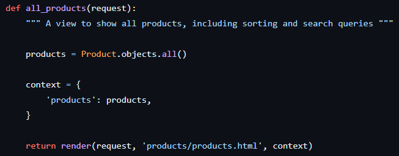

To render the products appropriately on the page, the products template was updated so that for every product passed to the template it would render a card showing the product image, name, price, rating and category.

**Commits from 4th Jan:**

A specific product's details can be accessed by clicking the product's image. On this page are two bootstrap columns, the first including the product image and the second showing the product name, description, rating and price.

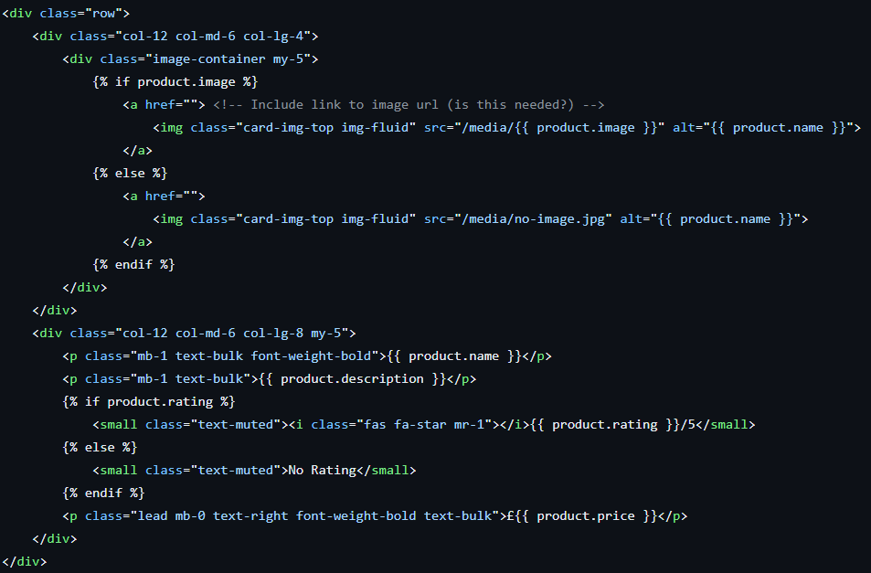

Within the products app views.py a view was added for the product_detail where it would pass the specific product's id to the template.

This view and url path was also added the products app urls.py file.

**Commits from 5th Jan:**

To enhance the user experience of the site on longer site pages, a back to top button was added to the bottom right-hand corner of the products template. This was done using a small amount of JavaScript at the bottom of the products.html template.

A quantity option was also added to the product detail page so the user could increase or decrease the quantity they would like to add to their basket. This was also done using JavaScript to first disable the plus and minus buttons when the quantity in the input is at the minimum or maximum (1 and 99). The bottom two functions are for incrementing the decrementing the input quantity when either the plus or minus button is clicked.

**Commits from 7th Jan:**

The final element of the products app was to show the category title and description at the top of the products page.

To do this an if, elif, else statement was included within the products template to determine which category the user was viewing and render the appropriate title and description for the category.

Looking back at this addition, it would have been easier and cleaner to include a description within the Category model that could be accessed from the products template. If there is time towards the end of the project, this may be implemented.

#### Product Filtering & Searching

**Commits from 4th Jan:**

Search functionality was added to the products view through a number of if statements looking for a query within the GET request and then filtering all products by determining if that query is in the product name or description and returning the filtered products to the template.

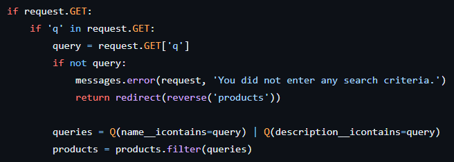

Category filtering was also done using if statements to first determine if 'category' was in the get request and then taking the category or categories minus any commas and filtering the products based on those categories. They are then passed to the template to be rendered.

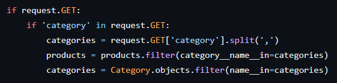

#### Product Sorting

**Commits from 5th Jan:**

The sort functionality was added to the product view and first looks at what it's being sorted by and assigns it to the sortkey. It then checks if there is a direction to the sort and will arrange the sortkey either ascending or descending.

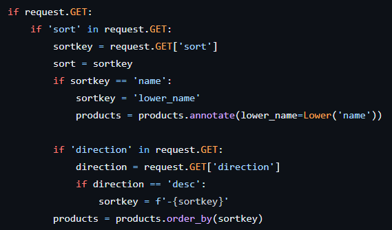

Below is the final all_products view containig the sort, search & filter functionality.

#### Adding & Modifying Products

**Commits froms 14th Jan:**

To add or modify a product first a product form was needed that could be rendered to the frontend. A new forms.py file was created within the products app and the Product and Category models were imported into it.

For adding products, an add product view was created within views.py. This view first looks for if the request is a POST request, if so it will check if the form is valid and either save the new product or throw an error message. If the request is not a POST request it will simply render an empty product for the user to fill out.

To edit a product, an edit product view was created within views.py. This view first sets the product sent from the product detail page and then looks for if the request is a POST request. If so, it will check if the form is valid and either save the updated product information or throw an error message. If the request is not a POST request, it will render the product form with the fields pre-filled with the product's information ready to be updated by the user.

To delete a product a view was also added to views.py. This view first assigns the product sent from the product detail page to a variable called product and then deletes it providing the user with a message to confirm the product has been deleted.

Finally, the add, edit and delete product views were secured so that only superusers or store owners could access this functionality. This was done by importing the login_required decorator from django.contrib.auth.decorators and using '@login_required' above the add, edit and delete product views.

#### Product Reviews

**Commits froms 16th Jan:**

A later addition to the products app was the ability to read and add product reviews. For this a Review model was created with the products app models.py file following the data schema. This model was then registered in the products app admin.py file.

After creating this model, migrations were made to ensure it could be accessed correctly.

Next, the ability for a user to add a review was added to the products app views.py file so that when a user chooses to add a product review from the product detail page they are directed to a review form. The form was added to the forms.py file within the products app and then the view for adding a product was duplicated and customised to fit the function of adding a review.

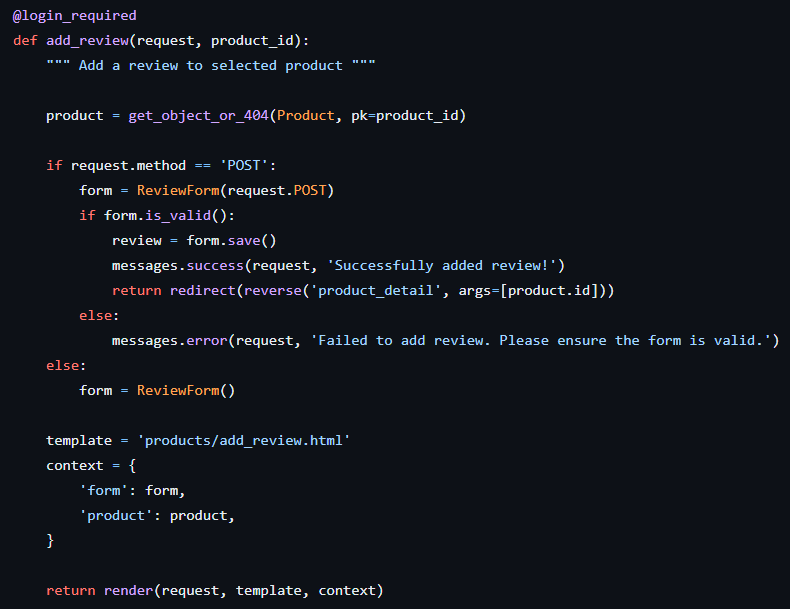

**Commits from 18th Jan:**

The product detail template was updated to include product reviews at the bottom of the page. An if statement was used to check if the reviews passed to the template exist. If they do a for loop iterates through the reviews and shows each reviews title, data, content and rating. If no reviews are passed to the template text is rendered instead saying 'No reviews yet.'.

Finally, a bug within the add review functionality was fixed so that when a user creates a review the product from the product detail page they have come from is assigned to their review. This prevents the product field being left as NULL or users being able to assign reviews to any product from the add review form.

To do this the form is first saved however not committed and instead the review.product field is set to the product passed to the view from the product detail page. Then the form is saved and the user is redirected back to the product detail page where they can see their review has been added.

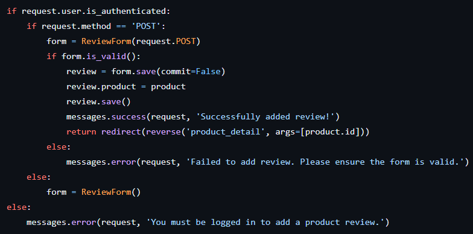

### Basket App

**Commits from 5th Jan:**

The basket app was created using the command 'python3 manage.py startapp basket' in the terminal. It was then added to the installed apps within the settings.py and a path was created witin the basket app urls.py file.

A basket_contents view was added to the basket views.py to get the products that the user has added to their basket so they could be added to the context and passed to the basket template.

The delivery logic was also added to this view to determine the free_delivery_delta and inform the customer of whether they have free delivery or how much more they need to spend to get free delivery.

Finally, the total of the basket content and delivery are added together to get the grand total of the user's basket.

Next the add to basket functionality was added to the basket views.py. This view takes the item id of the product being added and looks for the quantity being added. If the item is already in the basket it will update the quantity in the basket, otherwise it will add the item to the basket.

Within the basket, the update and remove options were added to each product line within the basket. This was done using JavaScript at the bottom of the basket template. The update function takes the quantity value and updates it within the basket. The remove function removes the specific product from the basket.

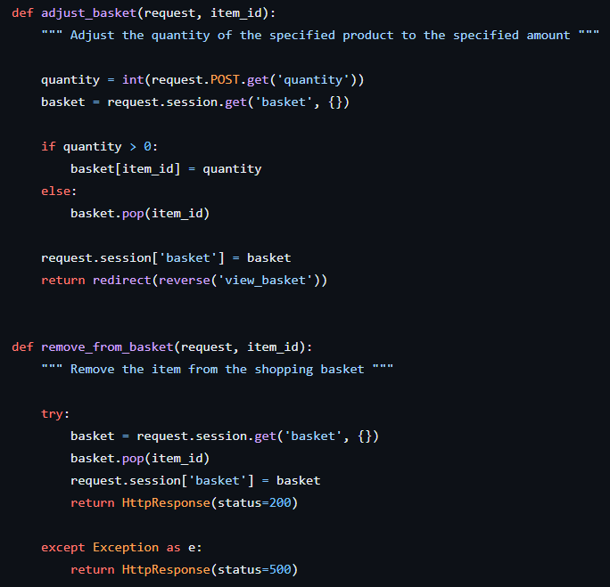

**Commits from 6th Jan:**

Within the basket app a new file called basket_tools.py was created to handle the calculating the subtotal of each product line within the basket. This was loaded into the basket template by adding the '' tag at the top of the template.

### Checkout

**Commits from 6th Jan:**

The checkout app was created using the command 'python3 manage.py startapp checkout'. It was then added to the installed apps within the settings.py and a path was created witin the checkout app urls.py file.

First, the order and order line item models were created following the data schema.

Within the order model a generate order number function, update function and save function were created to generate an order number using uuid, update the grand total each a line is added to the order and override the original save method to set the order number.

Within the order line item model the save function was also added to override the original save method to set the line item total and update the order total.

Next, the order form was created using django forms and only contains the fields necessary for the user to place an order. The rest of the fields are created automatically.

A signals.py file was created within the checkout app to ensure that the order would be updated or deleted depending on edits made within the site admin.

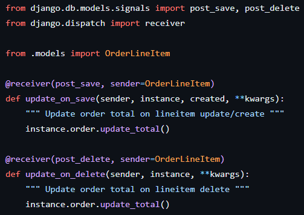

The checkout view was created within the checkout app views.py file, it takes the user's basket and creates an order form for that basket from the checkout forms.py file.

OrderLineItemAdminInLine and OrderAdmin were added to the checkout admin.py file to ensure the correct fields submitted by the user when they place an order remain read only so they cannot be edited.

**Commits from 8th Jan:**

The payment functionality on the site is handled using Stripe payments. For this a stripe_elements.js file was created within the checkout app to create the stripe elements and mount them to card element within the checkout template.

Error handling was also added to this file to ensure any errors with the card element are signposted to the user.

To handle the submit button for the payment form, an event listener was added to the button and upon clicking this the ability to edit the form or click the button again is disabled whilst the details are checked by Stripe. If there is an error this is signposted to the user and the form is re-enabled so they can make the required changes. If this is successful, the form is submitted and the payment is succeeded.

Finally, the required stripe public key and secret key were added to the settings.py file so it could be accessed across the site.

To get the checkout functionality working, the checkout url and checkout success url were added to checkout urls.py file.

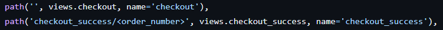

The checkout_success view was created to handle successful checkouts. It gets the order number from the order and returns it to the user in a toast message. And then deletes the basket from the session. It then returns the order context to the template to be rendered on the page.

**Commits from 9th Jan:**

A checkout success template was created to take the order information passed to it from the view and render it to the user in a table.

A small amount of webhook handling was included, however this was not specified in the project criteria, therefore will only be revisited if time at the end of the project.

**Commits from 14th Jan:**

The environment variables required for stripe were added to an env.py file which would be kept out of version control. This meant the variables didn't have to exported to gitpod each time the server was restarted.

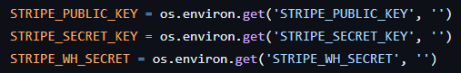

### Messages

**Commits from 6th Jan:**

Toast messages were added to signpost users throughout the site based on their actions.

Within the templates/includes folder, a new folder was created for toasts to include the html files for the four different kinds of toast messages.

At the bottom of the base template an if, elif, else statement was added to determine which toast message should be shown to the user depending on it's level.

Finally, the JavaScript for toasts was added to the very bottom of the base template in the postloadjs block.

### Profile

**Commits from 9th Jan:**

The profile app was created using the command 'python3 manage.py startapp profile'. It was then added to the installed apps within the settings.py and a path was created witin the profile app urls.py file.

The UserProfile model was added to the models.py file within the profile app following the data schema. A create or update user profile function was added to either create a user profile if the user is new or update an existing profile for existing users.

**Commits from 14th Jan:**

A forms.py file was created within the profiles app and a user profile was added to it. This form takes the users default delivery information and allows them to delete or update the information.

The profile view was added to the profiles app views.py. This view first checks if the request is a POST request and will save the form if valid. Else it will render an empty user profile form.

Next, the user's order history was added to the profile page. This was done by creating an order history view within the profiles app views.py. This allows the user to view previous orders (through the checkout_success page) and see an info message telling them they are viewing an old order and not a current order.

Finally, the save information functionality was setup within the checkout success view to allow users to save their delivery information to their profile. This view takes the delivery information and passes it to the user profile form and saves it to the user's profile.

## Testing During Development
During site development the local server was run to check that the site was rendering as expected when new functionality or edits were being implemented. This meant a lot of minor issues to do with functionality and styling were fixed alongside site development. Below are the larger bug fixes that were found when testing the site during development.

**Bug Fix 1:** Site footer not staying at the bottom of pages with less than a full screen height's worth of content.

To resolve this bug, the content block in the base.html page which contains the body and footer was wrapped within a container with the class 'min-vh-90'. Then within the base.css the min-vh-90 class was set to a minimum height of 90vh so that the body and footer content would be at least 90% of the vertical screen height, meaning pages with less content still have the footer at the bottom of the page.

**Bug Fix 2:** The toast success message always showed the basket if it contained items. Menaing that when a store owner adds or edits a product or when a user adds a review, if they have items in their basket they are also shown the basket along with the success message.

Initially to resolve this issue, the 'on_profile_page' variable was also added to the views where the basket was incorrectly rendering in the success message. However this didn't resolve the bug properly. Therefore, for any actions where a success message was used and the basket is not supposed to render, an info message was used instead.

**Bug Fix 3:** Deleting a product was too easy, meaning store owners could accidentally delete a product since it only required one click. To confirm that a store owner would like to delete a product, a modal was added so it requires two clicks from the user to delete a product.

**Bug Fix 4:** The quantity input buttons on both the product detail and basket page were not working correctly. They were being enabled and disabled correctly, however clicking the buttons did not affect the quantity input. This fix took quite a lot of experimenting and printing different variables to the console to check at what point in the JavaScript the quantity input was failing.

It was found that the 'this' element used when setting the itemId variable was not being recognised. This was changed for the .qty_input class and fixed the problem.

## Pre-Deployment Testing
A large amount of the required testing was completed prior to deploying the site so that the majority of the problems could be found and resolved on the local server as it is much quicker to check that problems have been resolved and doesn't require a new commit for every minor styling issue.

### Responsiveness
The site was tested on a multitude of screen sizes using Chrome developer tools to check that the site renders correctly on all screens tested and that all images and links work properly.

Screen Width | | | | | Device | | | | |
---: | :---: | :---: | :---: | :---: | :---: | :---: | :---: | :---: | :---:
| | Galaxy S9+ (320px) | iPhone 6/7/8 (375px) | iPhone XR (414px) | iPad Mini (768px) | iPad Air (820px) | Surface Pro 7 (912px) | iPad Pro (1024px) | Desktop (1201px) | Desktop (2000px)
<= 576px | Good | Good | Good | NA | NA | NA | NA | NA | NA
576px < >= 992px | NA | NA | NA | Good | Good | Good | NA | NA | NA
992px < | NA | NA | NA | NA | NA | NA | Good | Good | Good
Links/ URLs/ Buttons work | Yes | Yes | Yes | Yes | Yes | Yes | Yes | Yes | Yes
Images work | Yes | Yes | Yes | Yes | Yes | Yes | Yes | Yes | Yes
Renders as expected | Partially, details below | Partially, details below | Partially, details below | Partially, details below | Partially, details below | Partially, details below | Yes | Yes | Yes

This is the list of issues found when checking the responsiveness of the site on mobile and tablet screens.

Mobile Screens:
- Home app
    - [x] Nav icons hover/ click same colour as background
    - [x] Contact view needs info message rather than success message
    - [x] Missing page links from footer
    - [x] Socials missing from footer
- Products app
    - [x] Sort by and no. of products not margin/padded very well
    - [x] Quantity form very narrow
    - [x] Keep shopping/ add to basket buttons too far apart vertically and not full width
    - [x] Add review button not full width
    - [x] Search criteria falling off edge of page
    - [x] Category descriptions too long - Maybe shorten on all screens or truncate
    - [ ] Review ratings can be up to 9.9 rather than 5.0
- Basket app
    - [x] Shopping basket requires side scrolling - Needs refactoring on mobile
- Checkout app
    - [-] Card number overlaps expiry - Accept this is only on screens beneath 345px
    - [x] Buttons need margin and not full width
    - [x] Overlay doing some weird things, needs some work
    - [x] Order number needs truncating on mobile
- Profiles app
    - [x] Order history is too narrow - May need refactoring similar to shopping basket
    - [x] Update info button not full width
- Allauth pages
    - [x] No margin under buttons
    - [x] Buttons have no margin between them and not full width
- Possible issues with dev tools - check on physical mobile screen once deployed
    - Btt button half off screen on right
    - Navbar partially hides when scrolling
    - Very slow scrolling
    - Dropdown nav doesn't disappear on next click - Have to click on toggler to hide it

Tablet Screens:
- Basket app
    - [x] Shopping basket requires side scrolling - Needs refactoring on tablet too
- Products app
    - [x] 768px - 992px wide: Forms only half screen, could be a bit wider
    - [x] Category descriptions too long - Maybe shorten on all screens or truncate

The majority of these issues were related to styling and could be resolved quite easily either with a bootstrap or custom css class. These bug fixes can be found in commits 87-91 from 21st - 24th Jan 2024 in the github repository.

A larger bug fix that came from responsiveness testing was refactoring the shopping basket and order history pages so they would render better on mobile and not require any sideways scrolling.

For the basket page, this was done by splitting the basket template into multiple elements templates that could be included within the main basket template. On mobile the table that was used is hidden and instead the basket information is rendered as a list. And on tablet screens or larger, the mobile list is hidden and the table is shown and using the include tag to access the same information from the individual basket element templates.

The same thinking was applied to the order history section of the profile page, however the content wasn't split into separate templates since there wasn't as much code as required in the basket template.

### Browser Compatibility
The site was tested in multiple browsers to ensure all features worked correctly and the site responded in the intended way no matter what browser was being used.

| | Browser | | | Notes
:--- | :--- | --- | --- | ---
| | Chrome | Edge | Firefox
Intended Appearance? | Yes | Yes | Yes | Site renders as expected on all browsers tested
Intended Responsiveness? | Yes | Yes | Yes | Site responds as expected on all browsers tested
Buttons Work as Expected? | Yes | Yes | Yes | Buttons function as expected on all browsers tested
Forms Work as Expected? | Yes | Yes | Yes | Forms work as expected on all browsers tested

A lot of the issues with the site were luckily found during responsiveness testing, below is a list of issues found during testing on different browsers.

- Loading overlay on mobile covers the footer rather than main page content - CHeck on physical mobile screen on deployed.

- The quantity buttons within the shopping basket page only work correctly on the first item in the basket. The buttons for subsequent items change the quantity of the first item. This was missed during responsiveness testing because the shopping basket needed refactoring at this point. This bug was actually caused by a typo in the quantity form template... on the button tags, the data-item_id was written with a - rather than an _. This also meant the earlier bug fix for the quantity buttons on the product detail template could now be reverted as well.

    

    

### Code Validation
The HTML, CSS, JavaScript and Python for the site was ran through a validator specific to each language, the results are shown in the list below.

#### HTML

Checked on: https://validator.w3.org/

HTML code was copied directly from Chrome Developer Tools since the Jinja templating in the actual code would throw validation errors. Not every single site page was validated as most of them are duplicates, for example the individual category pages or the adding/editing product forms.

**Errors:**
- 'transform: var(--fa-rotate-angle, none) is not a transform value' - This is part of the fontawesome pre-written code and therefore cannot be changed.
- Duplicate IDs 'user-options' & 'mobile-search' - This is because the base template and mobile-top-header both contain the account and search buttons within the navigation however only one is visible depending on the screen size, therefore the duplicate cannot be removed without impacting the function of the site on different screen sizes.
- 'An img element must have an alt attribute' - Alt attributes were missing from the shopping basket images, the alt attribute for the products shopping basket images were set to product.name.
- Duplicate IDs set for the remove from basket button - This is because the shopping basket was refactored using bootstrap display classes so that on mobile it is a list and on tablet or desktop it is a table. This means there are two remove from basket buttons for each product within the HTML code however only one is visible on the rendered site. 
- Errors regarding the Stripe iframe:
    - 'Bad value __privateStripeMetricsController2220 for attribute name on element iframe'
    - 'The frameborder attribute on the iframe element is obsolete'
    - 'The allowtransparency attribute on the iframe element is obsolete'
    - 'The scrolling attirbute on the iframe element is obsolete'
    - The above errors are all part of the stripe pre-written code and therefore cannot be changed.

**Warnings:**
- The type attribute is unnecessary for JavaScript resources.
- Empty heading on the h1 tag with the loading overlay class.

#### CSS

Checked on: https://jigsaw.w3.org/css-validator/

**Errors:** No errors

**Warnings:** No warnings

#### JavaScript

Checked on: https://jshint.com/

**Errors:** No errors

**Warnings:** 
- Various missing semicolons - These were added to the JavaScript where required
- Template literal syntax is only available in ES6

#### Python

Checked on: https://pep8ci.herokuapp.com/

Checking the python code on the PEP8 validator found some minor errors relating to indentation, long lines or missing/ additional lines. Most of these errors were fixed easily however a few lines of code that were too long couldn't be shortened without preventing the code from running, therefore these longer lines were left in the code to keep it functioning correctly.

**Errors:**
- Expected 2 blank lines before function, found 1
- Line longer that 79 characters
- Over/ Under indentation on continuation line

**Warnings:** 
- No blank newline at end of file

### User Story Testing
To ensure the site met the original user goal's outlined in the [User Stories](#user-stories) section, each goal was tested to check that it was met by the finished site.

User Story ID | User | I Want To Be Able To... | Testing
:--- | :--- | :--- | :---
**Viewing & Navigation**
1 | Shopper | View a list of products | From the 'Shop All' option in the navigation the user can click the 'All Products' option to view all products on one page.
2 | Shopper | View a category of products | In the main navigation the user can select the category from 'Home', 'Kitchen', 'Beauty' or 'Pets' to view all products within a specific category.
3 | Shopper | View individual product details | When viewing a list of products either from the index page, the all products view or a product category view, the user can click the product image to be directed to the product detail page where they can view an individual product's details.
4 | Shopper | View product and company sustainability credentials | From the site footer the user can click the 'About Us' link to view information about EcoRoots and their sustainability efforts.
5 | Shopper | View product reviews and ratings | When viewing an individual product detail page the product reviews are underneath the product image and information.
6 | Shopper | Identify new product arrivals to the site | On the index page the new arrivals category is shown in the first section of the page. The user can also click the 'New Arrivals' link under a new product to view the whole category on a single page.
7 | Shopper | View the total of my purchases at any time | If the user has items in their shopping basket, the grand total is shown beneath the shopping basket link in the site navigation. However, this isn't shown on mobile but the user still receives a success message showing their basket when they add any products to their basket.
8 | Shopper | View bundles of products | On the index page the bundles category is shown in the second section of the page. The user can also click the 'Bundles' link under a new product to view the whole category on a single page.
**Registration & User Accounts**
9 | Site User | Easily register for an account | The 'My Account' link in the site navigation has a 'Regsiter' option if the session user is not already logged in. On the registration page they can register for an account by entering their email address and creating a username and password.
10 | Site User | Easily login or logout | The 'My Account' link in the site navigation has a 'Login' or 'Logout' option depending on if the session user is already logged in. Clicking 'Login' will take the user to a page where they can enter their username or email and password to login. Clicking 'Logout' will take the user to a confirmation page checking they would like to logout before actually logging them out of the site.
11 | Site User | Easily recover my password if it's forgotten | If a user has forgotten their password, from the login page they can click the 'Forgott Password?' button and they will directed to a page where they can enter their email address. They can then click the 'Reset My Password' button where they should be sent an email including a link to set a new password. Currently this is as far as the user can get as the site isn't sending emails.
12 | Site User | Have a personalised account profile | The 'My Account' link has a 'My Profile' option where the user can view their profile page. On this page is their order history, default delivery information and account information.
**Sorting & Searching**
13 | Shopper | Sort the available products | From the site navigation the 'Shop All' option can be sorted by price, rating or category. When viewing all products they can be sorted price, rating, name or category in ascending and descending order.
14 | Shopper | Sort a specific category of product | When viewing a specific category of products, the available products  can be sorted price, rating, name or category in ascending and descending order.
15 | Shopper | Sort multiple categories of products simultaneously | When viewing all products from various categories they can be sorted price, rating, name or category in ascending and descending order.
16 | Shopper | Search for a product by name or description | The 'Search' link in the site navigation allows the user to enter a search term and view all products where that search term is present in either the product name or description.
17 | Shopper | See what I've searched for and the number of results found | When filtering products by a search term, the number of products returned in the search along with the user's search term is shown above the list of filtered products.
**Purchasing & Checkout**
18 | Shopper | Add items to my basket and the desired quantity | When viewing a product detail page, underneath the product information is a form to increase or decrease the quantity of the product (within 1-99) followed by an 'Add To Basket' button. Clicking this button will add the current quantity of that product to the user's basket.
19 | Shopper | View items in my basket | Clicking the 'Basket' link in the site navigation will direct the user to their shopping basket where they can view all the products in their basket.
20 | Shopper | Easily update the quantity of a product in the basket | When viewing the shopping basket, each line item has a form allowing the user to increase or decrease the quantity of that specific item within their basket. Once the user has corrected the quantity they can click the 'Update' button underneath to save their changes to the basket.
21 | Shopper | Remove an item from the basket | Underneath the quantity input form for the line item in the shopping basket is a 'Remove' link, by clicking 'Remove' the user can remove that specific product and quantity from the basket.
22 | Shopper | Easily enter my delivery and payment information | When on the checkout page, the user is presented with a form where they can enter their delivery information. If they have any delivery information already saved to their profile, this will be pre-filled in the form.
23 | Shopper | View details about any errors when handling delivery and payment information | When the user attempts to complete checkout any errors will be shown on the specific form field that has caused the error. Any errors with the card details field are handled by Stripe and therefore look slightly different.
24 | Shopper | View an order confirmation after checkout | Upon successfully checking out the user is directed to the checkout success page showing their order details including their order number, order date, product details, delivery information and order total.
**Interacting with the Store**
25 | Site User | Contact the store with any queries | From the site footer the user can click the 'Contact Us' link where they are redirected to the contact form. They can fill out this form with their name, email and query which can be reviewed by the store owners.
26 | Shopper | Add reviews to products I have purchased | After purchasing a product, the user can return to the product detail page and click the 'Add Review' button. This will direct them to the add review form where they can add a review title, content and rating. Upon submitting this form the review will be shown on that individual product's detail page.
**Admin & Store Management**
27 | Store Owner | Add a product | The 'My Account' link in the site navigation has a 'Product Management' option that is only available to a store owner account. On the product management page is a form to add a product, the store owner can include the category, sku, product name, product description, price, rating and image.
28 | Store Owner | Edit a product's details | When viewing an individual product detail page from a store owner account, above the quantity input form is an 'Edit' button that directs the store owner to a form where they can edit that specific product's details. The current details will already be pre-filled in the form.
29 | Store Owner | Delete a product | When viewing an individual product detail page from a store owner account, above the quantity input form is a 'Delete' button. Clicking the delete button will open a confirmation modal asking the user to confirm they would like to delete the product or return to the product detail page and close the modal.
30 | Store Owner | View contact requests | The 'My Account' link in the site navigation has a 'Review Contact Requests' option that is only available to a store owner account. On the review contact requests page the store owner can view a list of contact requests showing the name, email and query that users have submitted.

From user story testing a few minor site elements were found to be missing:

- The new arrivals and bundles categories don't have subheadings or descriptions - These were added to the products.html file.
- The grand total isn't visible on mobile view - This was experimented with however was decided not to be included because it would make the navigation taller on mobile view which will push every page's content out of alignment because a header container of a specific site is used throughout to push the content below the navigation.
- Recovering a forgotten password currently can't be done as the site isn't sending emails - Sending emails functionality was tried before beginning the testing process however was not working properly, this functionality will be tried again once the site testing is complete and if their is time prior to the deadline.

### Feature Testing
The site features were tested to ensure they provide the correct user feedback. They were tested in sections depending on the area of the site being tested, this was so any bugs could be fixed quicky after being spotted and the list of bug fixes did not become too large to tackle in one go.

Feature | Action | Effect
--- | --- | ---
**Navigation**
Logo (all pages) | Hover over | Cursor changes to a pointer, colour changes to deep olive
| | Click | Direct users to the site home
Main Navigation (<768px wide) (all pages) | Hover over toggler | Cursor changes to a pointer, colour changes to deep olive
| | Click toggler | Opens mobile main navigation as dropdown menu
| | Hover over category | Cursor changes to a pointer, colour changes to muted green
| | Click category | Directs user to selected category
| | Click shop all | Opens dropdown menu of sort options
| | Hover over shop all option | Background colour changes to light grey
| | Click shop all option | Directs user to all products page with chosen sorting applied
Main Navigation (>=768px wide) (all pages) | Hover over my account, search or basket (when no grand total) | Cursor changes to a pointer, colour changes to deep olive
| | Hover over basket (when grand total is >0) | Cursor changes to a pointer, colour changes to rustic brown
| | Click my account | Opens account dropdown
| | Hover over account option | Background colour changes to light grey
| | Click account option | Directs user to chosen account page
| | Click search from navigation | Opens search bar in dropdown
| | Click search from search bar | If search criteria - Directs user to all products page, with products filtered by search criteria shown above the products view. If no search criteria - Directs user to all products page and shows error message: 'You did not enter any search criteria'
| | Click basket | Directs user to the shopping basket page
Top navigation (<768px wide) (all pages) | Hover over my account, search or basket (when no grand total) | Cursor changes to a pointer, colour changes to rustic brown
| | Hover over basket (when grand total is >0) | Cursor changes to a pointer, colour changes to rustic brown
| | Click my account | Opens account dropdown
| | Hover over account option | Background colour changes to light grey
| | Click account option | Directs user to chosen account page
| | Click search from navigation | Opens search bar in dropdown
| | Click search from search bar | If search criteria - Directs user to all products page, with products filtered by search criteria shown above the products view. If no search criteria - Directs user to all products page and shows error message: 'You did not enter any search criteria'
Top navigation (>=768px wide) (all pages) | Hover over product category | Cursor changes to a pointer, colour changes to muted green
| | Click category | Directs user to selected category
| | Click shop all | Opens dropdown menu of sort options
| | Hover over shop all option | Background colour changes to light grey
| | Click shop all option | Directs user to all products page with chosen sorting applied

From feature testing the site navigation, the below bug was found:
- Top navigation hover colour should be muted green except for the basket when grand total is >0 - This was caused by the CSS missing a muted green hover class for the mobile nav items, therefore all three were using the basket hover CSS.

Feature | Action | Effect
--- | --- | ---
**User Authentication**
Registration page | Current form field | Border highlighted in blue, type cursor in field
| | Hover over back to login button | Cursor changes to a pointer, text colour changes to deep olive
| | Click back to login button | Directs user to the login page
| | Hover over the register button | Cursor changes to a pointer, text colour changes to muted green
| | Click register button | If form is valid - Directs user to site home page, success message shows 'Successfully logged in as [username]. If form is not valid - Error is shown on the affected form field.
Login page | Current form field | Border highlighted in blue, type cursor in field
| | Hover over home button | Cursor changes to a pointer, text colour changes to deep olive
| | Click home button | Directs user to the site home page
| | Hover over the login button | Cursor changes to a pointer, text colour changes to muted green
| | Click login button | If form is valid - Directs user to site home page, success message shows 'Successfully logged in as [username]. If form is not valid - Error is shown on the affected form field.
| | Hover over forgot password? | Cursor changes to pointer, colour changes to deep olive, text is underlined
| | Click forgot password? | Directs user to forgot password page
Forgot password page | Current form field | Border highlighted in blue, type cursor in field
| | Hover over back to login button | Cursor changes to a pointer
| | Click back to login button | Directs user to the login page
| | Hover over the reset my password button | Cursor changes to a pointer
| | Click reset my password button | If form is valid - Form is hidden and text informs user an email has been sent to them. If form is not valid - Error is shown on the affected form field.
Logout page | Hover over cancel button | Cursor changes to a pointer, text colour changes to deep olive
| | Click cancel button | Directs user to the site home page
| | Hover over sign out button | Cursor changes to a pointer, text colour changes to muted green
| | Click sign out button | Directs user to site home page, success message shows: 'You have signed out'

From feature testing the user authentication, the following bugs were found:
- Successful login message also shows the basket if grand total is >0 - Since this is controlled within the allauth code, it cannot be easily fixed, therefore will be revisited during future improvements if time prior to the deadline.
- Two forgot password links on login page - The second link was removed and the first was styled appropriately with the page.
- Forgot password page is not styled correctly - The password reset template was styled using the same bootstrap classes as used on other allauth templates.
- Site is not sending emails for email verification or password reset - Sending emails functionality was tried before beginning the testing process however was not working properly, this functionality will be tried again once the site testing is complete and if their is time prior to the deadline.

Feature | Action | Effect
--- | --- | ---
**Home App**
New Arrivals & Bundles sections | Hover over product image | Cursor changes to a pointer
| | Click product image | Directs user to product details page
| | Hover over product category | Cursor changes to a pointer, text is underlined
| | Click product category | Directs user to selected category page
Site Footer | Hover over any useful links | Cursor changes to a pointer, colour changes to rustic brown
| | Click any useful link | Directs user to selected page
| | Hover over any social links | Cursor changes to a pointer, colour changes to rustic brown
| | Click any social link | Opens the selected social page in a new tab

No bugs were found from feature testing the home app.

Feature | Action | Effect
--- | --- | ---
**Products App**
All Products view | Click sort by | Opens dropdown of sorting options
| | Hover over sort option | Background colour changes to blue
|  | Click sort option | Sorts all products by selected sorting, outline of soty by box turns blue
| | Hover over product image | Cursor changes to a pointer
| | Click product image | Directs user to product details page
| | Hover over product category | Cursor changes to a pointer, text is underlined
| | Click product category | Directs user to selected category page
Product Category view | Hover over all products link | Cursor changes to a pointer, text is underlined
| | Click all products link | Directs user to all products view
Product Detail page | Hover over product category | Cursor changes to a pointer, text is underlined
| | Click product category | Directs user to selected category page
| | Hover over edit link | Cursor changes to a pointer, colour changes to deep olive, text is underlined
| | Click edit button | Directs user to edit product page
| | Hover over delete button | Cursor changes to a pointer, colour changes to darker red, text is underlined
| | Click delete button | Opens modal at top of the page
| | Hover over close button | Cursor changes to a pointer, text colour changes to deep olive
| | Click close button | Closes modal
| | Hover over yes, delete button | Cursor changes to a pointer, button colour changes to darker red
| | Click yes, delete button | Directs user to all products view, message shows product has been deleted
| | Hover over plus or minus button | Plus or minus colour changes to muted green
| | Click plus or minus button | Does not increase or decrease the product quantity
| | Hover over keep shopping button | Cursor changes to a pointer, colour changes to deep olive
| | Click keep shopping button | Directs user to all products view
| | Hover over add to basket button | Cursor changes to a pointer, colour changes to muted green
| | Click add to basket button | Success message shows: 'Added [product name] to your basket, grand total in site navigation updated
| | Hover over add review button | Cursor changes to a pointer, colour changes to deep olive
| | Click add review button | Directs user to add review page
Add Product page | Current form field | Border highlighted in blue, type cursor in field
| | Hover over cancel button | Cursor changes to a pointer, text colour changes to deep olive
| | Click cancel button | Directs user to the all products view
| | Hover over add product button | Cursor changes to a pointer, text colour changes to muted green
| | Click add product button | If form is valid - Directs user to the product detail page for the new product, info message shows 'Successfully added product'. If form is not valid - Error is shown on the affected form field.
Edit Product page | When page loaded | Info message shows: 'You are editing [product name]
| | Current form field | Border highlighted in blue, type cursor in field
| | Hover over cancel button | Cursor changes to a pointer, text colour changes to deep olive
| | Click cancel button | Directs user to the product detail page
| | Hover over update product button | Cursor changes to a pointer, text colour changes to muted green
| | Click update product button | If form is valid - Directs user to the product detail page for the updated product, info message shows 'Successfully updated product'. If form is not valid - Error is shown on the affected form field.
Add Review page | Current form field | Border highlighted in blue, type cursor in field
| | Hover over cancel button | Cursor changes to a pointer, text colour changes to deep olive
| | Click cancel button | Directs user back to the product detail page
| | Hover over add review button | Cursor changes to a pointer, text colour changes to muted green
| | Click add review button | If form is valid - Directs user to the product detail page, info message shows 'Successfully added review'. If form is not valid - Error is shown on the affected form field.

From feature testing the products app, the following bugs were found:
- Quantity input buttons no longer work on product detail page - This bug reappeared after fixing the quantity button problem with the shopping basket. Therefore, to fix this problem, the script was duplicated and reverted to it's old version for the product detail page but the kept as the latest version for the shopping basket page.
- Keep shopping button directs user to all products view even when coming from a category page - Updating the keep shopping button to return to a certain category would require refactoring the product views, therefore will be looked at in more detail if time prior to the deadline.

Feature | Action | Effect
--- | --- | ---
**Basket App**
Shopping Basket Page | Hover over plus or minus buttons | Cursor changes to a pointer, colour changes to muted green
| | Click plus or minus buttons | Quantity of product line item increases or decreases appropriately
| | Hover over update link | Cursor changes to a pointer
| | Click update link | Quantity of product line item in basket updates, success message reads: 'Updated [product name] quantity to [quantity]'.
| | Hover over delete link | Cursor changes to a pointer, colour changes to dark red
| | Click delete link | Product line item is removed from basket, success message reads: Removed [product name] from your basket.
| | Hover over keep shopping button | Cursor changes to a pointer, colour changes to deep olive
| | Click keep shopping button | Directs user to all products page
| | Hover of secure checkout button | Cursor changes to apointer, colour changes to muted green
| | Click secure checkout button | Directs user to the checkout page

From feature testing the basket app, the following bugs were found:
- Update link doesn't change colour or have underline when hovered - This was fixed by moving the small-link class into the small tag as opposed to the a tag.
- Delete button doesn't have underline when hovered - This was fixed by moving the remove-item class into the small tag as opposed to the a tag and creating a remove-item hover class for the text-decoration.

Feature | Action | Effect
--- | --- | ---
**Checkout App**
Checkout page | Current form field | Border highlighted in grey, type cursor in field
| | Hover over save info checkbbox | Colour changes to darker blue or border changes to black depending on current toggle state
| | Click save info checkbox | Checkbox is toggled to either checked or unchecked
| | Stripe card details field | If valid card details entered - Card type shown on far left of field. If invalid card details entered - Error shows underneath reading: 'Your card number is invalid', text in field changes to red.
| | Hover over adjust bag button | Cursor changes to a pointer, text colour changes to deep olive
| | Click adjust bag button | Directs user back to the shopping basket page
| | Hover over complete order button | Cursor changes to a pointer, text colour changes to muted green
| | Click complete order button | If form is valid - Form is hidden and loading overlay spinner appears. User is directed to checkout success page with order details, success message reads: 'Order successfully processed! Your order number is [order number]. A confirmation email will be sent to [user email]. If form is not valid - Error is shown on the affected form field.
Checkout Success page | Hover over now check out the latest deals! button | Cursor changes to a pointer, colour changes to muted green
| | Click now check out the latest deals! buttons | Directs user to new arrivals category page

From feature testing the checkout app, the following bug was found:
- Upon successful checkout the page shrinks because the form is hidden, therefore the loading overlay spinner is showing on top of the footer - This was fixed by adding the bootstrap class 'bg-white' to the div containing the loading overlay spinner, this now means the whole page is covered whilst the order is being submitted and the checkout success page is loading.

Feature | Action | Effect
--- | --- | ---
**Profiles App**
Order History section | Hover over order number | Cursor changes to a pointer, colour changes to darker blue
| | Click order number | Directs user to past order confirmation page, alert message reads: 'This is a past confirmation for order number: [order number]
| | Hover over back to profile button | Cursor changes to a pointer, colour changes to deep olive
| | Click back to profile button | Directs user back to their profile page
Default Delivering Information section | Current form field | Border highlighted in blue, type cursor in field
| | Hover over update information button | Cursor changes to a pointer, text colour changes to muted green
| | Click update information button | If form is valid - Success message reads: 'Profile updated successfully'. If form is not valid - Error message reads: 'Update failed. Please ensure the form is valid'.

No bugs were found from feature testing the profiles app.

Feature | Action | Effect
--- | --- | ---
**Messages**
Success message | Hover over 'x' in top right | Cursor changes to a pointer, colour changes to darker grey
| | Click 'x' in top right | Message is dismissed
| | Scroll basket items (if more than two items in basket) | Reveals other items in basket
| | Hover over go to secure checkout button | Cursor changes to a pointer, colour changes to muted green
| | Click go to secure checkout button | Directs user to their shopping basket
Info message | Hover over 'x' in top right | Cursor changes to a pointer, colour changes to darker grey
| | Click 'x' in top right | Message is dismissed
Warning message Hover over 'x' in top right | Cursor changes to a pointer, colour changes to darker grey
| | Click 'x' in top right | Message is dismissed
Error message | Hover over 'x' in top right | Cursor changes to a pointer, colour changes to darker grey
| | Click 'x' in top right | Message is dismissed

No bugs were found from feature testing the messages.

## Deployment

Screenshot creating database in elephantSQL

Screenshot making new app in Heroku

heroku login after procfile

Automatic deployments after pushing to github

DEBUG = int(os.environ.get("DEVELOPMENT", default=0))

## Post-Deployment Testing

### Responsiveness

Screen Width | | | | | Device | | | | |
---: | :---: | :---: | :---: | :---: | :---: | :---: | :---: | :---: | :---:
| | Galaxy S9+ (320px) | iPhone 6/7/8 (375px) | iPhone XR (414px) | iPad Mini (768px) | iPad Air (820px) | Surface Pro 7 (912px) | iPad Pro (1024px) | Desktop (1201px) | Desktop (2000px)
<= 576px |  |  |  | NA | NA | NA | NA | NA | NA
576px < >= 992px | NA | NA | NA |  |  |  | NA | NA | NA
992px < | NA | NA | NA | NA | NA | NA |  |  | 
Links/ URLs/ Buttons work |  |  |  |  |  |  |  |  | 
Images work |  |  |  |  |  |  |  |  | 
Renders as expected |  |  |  |  |  |  |  |  | 

### Browser Compatibility

| | Browser | | | Notes
:--- | :--- | --- | --- | ---
| | Chrome | Edge | Firefox | Safari | Ecosia
Intended Appearance? |  |  |  |  |  |
Intended Responsiveness? |  |  |  |  |  |
Buttons Work as Expected? |  |  |  |  |  |
Forms Work as Expected? |  |  |  |  |  |

### Lighthouse Testing

#### Index Page

#### Contact Page

#### Products Page

#### Add/ Edit Product

#### Add Review Page

#### Shopping Basket

#### Checkout

#### Checkout Success

#### User Profile

Allauth not done as templates

### Future Improvements

reset password page not styled the same

Sort reviews by latest date

Emails - future improvment

Contact review needs pagination

README - JavaScript or JQuery?

**Future Additions (if time)**
31 | Site User | Receive a confirmation email after registering | Verify that my account was successfully created
32 | Site User | Add items to my wishlist | Save products that I'd like to purchase later
33 | Shopper | Receive a confirmation email after placing an order | Keep the order confirmation for my records

## Credits & Acknowledgements

Add comments to code where it's not my own or customised from a template

Mockups for renders <a href="https://www.freepik.com/free-vector/digital-device-mockup-set_4122518.htm#query=device%20mockup&position=8&from_view=search&track=ais&uuid=2c6b5773-48a8-4b9a-b8a0-4b83164331af">Image by rawpixel.com</a> on Freepik

No image found image = Image by <a href="https://www.freepik.com/free-vector/realistic-question-box-mockup_28846681.htm#query=mystery&position=1&from_view=search&track=sph&uuid=3ddffba5-4263-4cdb-8308-d88d826b07f6">Freepik</a>

favicon credit: <a href="https://www.flaticon.com/free-icons/leaf" title="leaf icons">Leaf icons created by Pixel perfect - Flaticon</a>